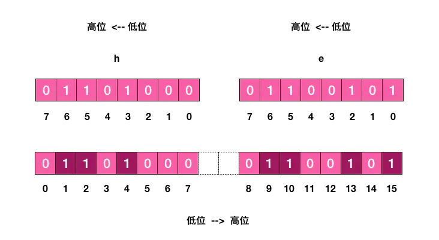

# 04、节衣缩食 —— 位图

在我们平时开发过程中，有时需要存储一些 bool 型数据，比如用户一年的签到记录，签到为 1，没签为 0，要记录 365 天。如果使用普通的 key/value，每个用户要记录 365 个，当用户上亿的时候，这个存储非常大。

那有什么可以解决存储 bool 型数据存储的空间问题吗？

答案是有的，用**位图**。Redis 提供了位图数据结构，这样每天签到记录只占用一位，365天就是365位，46（365/8=45...3）个字节完成可以容纳的下，这样大大节省了存储空间。

  

<center> 图1 位图结构</center>

位图不是特殊的数据结构，他的内容就是普通的字符串，也就是 byte 数组。我们可以通过 <font color='red'>`get/set`</font> 直接操作位图的内容，也可以使用位图专有的操作 <font color='red'>`getbit/setbit`</font>等将byte数组看成「位数组」来处理

## 基本使用

Redis 的位数组是自动扩展，如果设置了某个偏移量超出了现有的内容范围，就会自动将数组进行零扩充。（就是默认就是0）

> 值得注意的是位数组的顺序和字符的位顺序是相反的。(高位->低位) 8位一组



<center> 图2 位图实际的排序</center>

图2 展示了位图的实际存储过程，上面的是字符转成位图的数据（0和1），但是位图在我们命令操作时相反的，即 高位->低位 是数组的方向即从0到8n（n位字符数）

现在我们输入**”he“**，即h（01101000），e（01100101）

**零存整取 （位图 -> 字符串）**

```shell
127.0.0.1:6379> setbit s 1 1
(integer) 0
127.0.0.1:6379> setbit s 2 1
(integer) 0
127.0.0.1:6379> setbit s 4 1
(integer) 0
127.0.0.1:6379> setbit s 9 1
(integer) 0
127.0.0.1:6379> setbit s 10 1
(integer) 0
127.0.0.1:6379> setbit s 13 1
(integer) 0
127.0.0.1:6379> setbit s 15 1
(integer) 0
127.0.0.1:6379> get s
"he"
```

**零存零取 (位图 -> 位图 )**

```shell
127.0.0.1:6379> setbit w 1 1
(integer) 0
127.0.0.1:6379> setbit w 2 1
(integer) 0
127.0.0.1:6379> setbit w 4 1
(integer) 0
127.0.0.1:6379> getbit w 1 # 获取某个具体位置的值 0/1
(integer) 1
127.0.0.1:6379> getbit w 2
(integer) 1
127.0.0.1:6379> getbit w 4
(integer) 1
127.0.0.1:6379> getbit w 5
(integer) 0
```

**整存零取 (字符串 -> 位图 )**

```shell
127.0.0.1:6379> set w h # 整存
(integer) 0
127.0.0.1:6379> getbit w 1
(integer) 1
127.0.0.1:6379> getbit w 2
(integer) 1
127.0.0.1:6379> getbit w 4
(integer) 1
127.0.0.1:6379> getbit w 5
(integer) 0
```

如果对应位的字节是不可打印字符，redis-cli 会显示该字符的16进制形式。

```shell
127.0.0.1:6379> setbit x 0 1
(integer) 0
127.0.0.1:6379> setbit x 1 1
(integer) 0
127.0.0.1:6379> get x
"\xc0"
```

## 统计和查找

Redis 提供了位图统计指令 <font color='red'>`bicount`</font> 和位图查找指令 <font color='red'>`bitpos`</font>，**bicount 用来统计指定位置范围内1的个数，而bitpos 用来查找指定范围出现第一个0或1 **。

比如我们可以通过 bitcont 统计用一共签到了多少天，通过 bitpos 指令查找用户从那天开始第一次签到。 如果指定了范围参数 <font color='red'>`[start, end]`</font> ,就可以统计在某个时间范围内用户签到了多少天，用户自某天以后的哪天开始签到。

很遗憾的是**start 和 end 参数是字节索引，也就是说指定的位范围必须是 8 的倍数**

接下来我们简单试用一下 bitcount 指令和 bitpos 指令:

>注意 第0位时高位开始的，第 8n 位时低位方向

```shell
127.0.0.1:6379> set w hello
OK
127.0.0.1:6379> bitcount w
(integer) 21
127.0.0.1:6379> bitcount w 0 0 # 第一个(h)字符中 1 的位数
(integer) 3
127.0.0.1:6379> bitcount w 0 1 # 前两(he)个字符中 1 的位数
(integer) 7
127.0.0.1:6379> bitpos w 0 # (hello)第一个 0 位
(integer) 0
127.0.0.1:6379> bitpos w 1 # (hello)第一个 1 位
(integer) 1
127.0.0.1:6379> bitpos w 1 1 1 # 从第二个字符算起，第一个 1 位
(integer) 9
127.0.0.1:6379> bitpos w 1 2 2 # 从第三个字符算起，第一个 1 位
(integer) 17
```

## 魔术指令 bitfield

前文我们设置 (setbit) 和获取 (getbit) 指定位的值都是单个位的，如果要一次操作多个位，就必须使用管道来处理。

不过 Redis 的 3.2 版本以后新增了一个功能强大的指令，有了这条指令，不用管道也可以一次进行多个位的操作。

bitfield 有三个子指令，分别是 get/set/incrby，它们都可以对指定位片段进行读写，**但是最多只能处理 64 个连续的位**，如果超过 64 位，就得使用多个子指令，**bitfield 可以一次执行多个子指令。**

hello(0110 1000-0110 0101-0110 1100-0110 1100-0110 1111)

```mysql
127.0.0.1:6379> set w hello
OK
127.0.0.1:6379> bitfield w get u4 0 # 从第一个位开始取 4 个位，结果是无符号数 (u)
(integer) 6
127.0.0.1:6379> bitfield w get u3 2 # 从第三个位开始取 3 个位，结果是无符号数 (u)
(integer) 5
127.0.0.1:6379> bitfield w get i4 0 # 从第一个位开始取 4 个位，结果是有符号数 (i)
1) (integer) 6
127.0.0.1:6379> bitfield w get i3 2 # 从第三个位开始取 3 个位，结果是有符号数 (i)
1) (integer) -3
```

所谓有符号数是指获取的位数组中第一个位是符号位，剩下的才是值。如果第一位是 1，那就是负数。无符号数表示非负数，没有符号位，获取的位数组全部都是值。有符号数最多可以获取 64 位，无符号数只能获取 63 位 (因为 Redis 协议中的 integer 是有符号数，最大 64 位，不能传递 64 位无符号值)。如果超出位数限制，Redis 就会告诉你参数错误。

接下来我们一次执行多个子指令:

```shell
127.0.0.1:6379> bitfield w get u4 0 get u3 2 get i4 0 get i3 2
1) (integer) 6
2) (integer) 5
3) (integer) 6
4) (integer) -3
```

然后我们使用 set 子指令将第二个字符 e 改成 a，a 的 ASCII 码是 97。

```shell
127.0.0.1:6379> bitfield w set u8 8 97 # 从第 8 个位开始，将接下来的 8 个位用无符号数 97 替换
1) (integer) 101
127.0.0.1:6379> get w
"hallo"
```

再看第三个子指令 incrby ,它用来堆指定范围的位进行自增操作。既然提到了自增，就有可能溢出。如果增加了正数，会出现上溢，如果增加的是负数，就会出现下溢出。Redis 默认的处理是折返。如果出现了溢出，就将溢出的符号位丢掉。如果是 8 位无符号数 255，加 1 后就会溢出，会全部变零。如果是 8 位有符号数 127，加 1 后就会溢出变成 -128。

接下来我们实践一下这个子指令 incrby :

```shell
127.0.0.1:6379> set w hello
OK
127.0.0.1:6379> bitfield w incrby u4 2 1 # 从第三个位开始，对接下来的 4 位无符号数 +1
1) (integer) 11
127.0.0.1:6379> bitfield w incrby u4 2 1
1) (integer) 12
127.0.0.1:6379> bitfield w incrby u4 2 1
1) (integer) 13
127.0.0.1:6379> bitfield w incrby u4 2 1
1) (integer) 14
127.0.0.1:6379> bitfield w incrby u4 2 1
1) (integer) 15
127.0.0.1:6379> bitfield w incrby u4 2 1 # 溢出折返了
1) (integer) 0
```

bitfield 指令提供了溢出策略子指令 overflow，用户可以选择溢出行为，**默认是折返 (wrap)，还可以选择失败 (fail) 报错不执行，以及饱和截断 (sat)，超过了范围就停留在最大最小值。<u>overflow 指令只影响接下来的第一条指令</u>，这条指令执行完后溢出策略会变成默认值折返 (wrap)**。

接下来我们分别试试这两个策略的行为

**饱和截断 SAT**

```shell
127.0.0.1:6379> set w hello
OK
127.0.0.1:6379> bitfield w overflow sat incrby u4 2 1
1) (integer) 11
127.0.0.1:6379> bitfield w overflow sat incrby u4 2 1
1) (integer) 12
127.0.0.1:6379> bitfield w overflow sat incrby u4 2 1
1) (integer) 13
127.0.0.1:6379> bitfield w overflow sat incrby u4 2 1
1) (integer) 14
127.0.0.1:6379> bitfield w overflow sat incrby u4 2 1
1) (integer) 15
127.0.0.1:6379> bitfield w overflow sat incrby u4 2 1 # 保持最大值
1) (integer) 15
```

**失败不执行 FAIL**

```shell
127.0.0.1:6379> set w hello
OK
127.0.0.1:6379> bitfield w overflow fail incrby u4 2 1
1) (integer) 11
127.0.0.1:6379> bitfield w overflow fail incrby u4 2 1
1) (integer) 12
127.0.0.1:6379> bitfield w overflow fail incrby u4 2 1
1) (integer) 13
127.0.0.1:6379> bitfield w overflow fail incrby u4 2 1
1) (integer) 14
127.0.0.1:6379> bitfield w overflow fail incrby u4 2 1
1) (integer) 15
127.0.0.1:6379> bitfield w overflow fail incrby u4 2 1 # 不执行
1) (nil)
```

