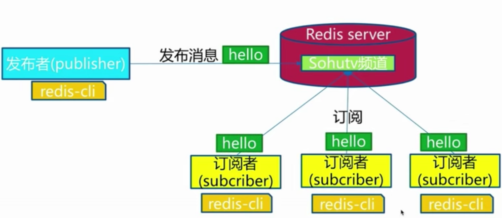
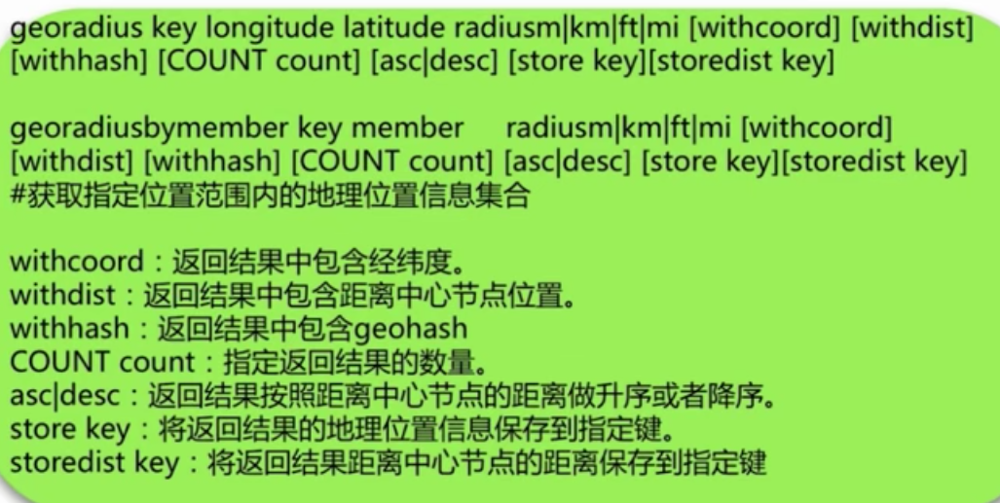

# Redis 多功能

### 慢查询

redis 的生命周期，如图 1：


<center>redis 生命周期</center>
**两点说明：**

- 慢查询发生在第3阶段；
- 客户端超时不一定慢查询，但慢查询是客户端超时的一个可能因素。

**什么是慢查询**

慢查询是 Redis 在内存中定义了一个固定大小的先进先出的队列，根据执行的时间，会把超过定义的时间的命令记录到队列中。 

**两个配置：**

- slowlog-max-len
  - 含义：慢查询队列的长度
- slowlog-log-solwer-than
  - 含义：超过改时间限制，就认为是慢查询（单位：微秒）
    - 等于 0 ，记录所有命令；
    - 小于0，不记录任何命令；
    -  大于 0（假设是N）,如果命令执行超过 N 微秒，就记录到慢查询中。

**如何配置慢查询参数：**

- 默认值
  - config get slowlog-max-len = 128
  - config get slowlog-log-slower-than = 10000
- 修改配置文件，重启 
- 动态配置
  - config set slowlog-max-len 1000
  - config set slowlog-log-slower-than 1000

**慢查询命令**

- slowlog get [N]												#  查询前 N 个慢查询记录 
- slowlog len                                                       # 获取慢查询队列长度
- slowlog reset                                                   # 清空慢查询

**运维经验**

- slowlog-max-len 不要设置过大，默认 10ms ，通常设置为 1ms（因为1秒内是万级别的，所以如果查询超过了 1ms 我们就应该认为对我系统产生了影响）
- slowlog-log-slower-than 不要设置过小，通常设置1000左右
- 理解 redis 生命周期
- 定期持久化慢查询 （通过 slowlog get [n]）

### pipeline (流水线)

- Redis 执行一条命令的步骤：

  1. 客户端向服务端传输命令
  2. 服务端计算命令
  3. 服务端返回给客户端数据

  1 次时间 = 1次网络时间（来回）+ 1次命令时间

- Redis 批量执行 N 条 命令步骤

  

  <center>图 2 执行 N 条 命令</center>
N 次时间 = N 次网络时间 + N 次命令时间
  
- pipeline

  

<center>图 3 执行 pipeline 命令</center>
​	1 次 pipeline (N 条命令) = 1 次网络时间 + N 条命令时间

*三点注意*

1. Redis 的命令时间是微秒级别。
2. pipeline 每次条数要控制（网络） 。如 10000 条命令，可以拆分为 10次，一次 1000 条
3. pipeline 的操作是非原子性的

**Jedis 上的实现**

```java
package dddy.gin.practice;

import redis.clients.jedis.Jedis;
import redis.clients.jedis.Pipeline;

/**
 * 对比 有无 pipeline 执行情况
 *
 * @author gin
 */
public class TestPipeline {
    /**
     * 100 的倍数！
     */
    private int num = 10000;
    private int oneTime = 100;
    private Jedis jedis = null;

    public TestPipeline() {
        jedis = new Jedis("192.168.99.100");
    }

    public void close(){
        if (jedis!=null){
            jedis.close();
        }
    }

    long notUsePipeline() {
        long startTime = System.currentTimeMillis();
        for (int i = 0; i < num; i++) {
            jedis.hset("hashKey:" + i, "field" + i, "value" + i);
        }
        long endTime = System.currentTimeMillis();
        return endTime - startTime;
    }

    long usePipeline() {
        int batch = num/oneTime;
        long startTime = System.currentTimeMillis();
        for (int i = 0; i < batch; i++) {
            Pipeline pipeline = jedis.pipelined();
            for (int j = i*oneTime; j < (i+1)*oneTime; j++) {
                pipeline.hset("hashKey:" + j, "field" + j, "value" + j);
            }
            pipeline.syncAndReturnAll();
        }
        long endTime = System.currentTimeMillis();
        return endTime - startTime;
    }

    public static void main(String[] args) {
        TestPipeline testPipeline = new TestPipeline();
        System.out.println("notUsePipeline: " + testPipeline.notUsePipeline());
        System.out.println("usePipeline: " +testPipeline.usePipeline());
        testPipeline.close();
    }
    
}

```


**使用建议**

1. 注意每次 pipeline 携带的数据量
2. pipeline 每一次只能作用在一个 Redis 节点上


### 发布订阅

**角色**

- 发布者（publisher）
- 订阅者（subscriber）
- 频道（channel）

**模型**



<center>图 4 发布订阅模型</center>
1. gang发布者端发布一条消息 “hello” 给 Redis 服务端 中的 Sohutv频道；
2. Redis服务端将会把这条消息发送给订阅 Sohutv频道的订阅者 （注意所有的订阅者都能收到）


**注意**

- 订阅该频道的订阅者都能收到消息
- 订阅者可以订阅多个频道
- 订阅者无法收到订阅前的数据 （无法做消息堆积，即历史记录）

**命令**

- publish channel message                                     # 向 channel 频道发布 message 消息
- subscribe [channel]                                               # 订阅 channel 频道（一个或者多个）
- unsubscribe  [channel]                                         #  退订 channel 频道（一个或者多个）
- psubscribe [pattern ...]                                         # 按模式 pattern  订阅频道
- punsubscribe  [pattern ...]                                   #  按模式 pattern 退订 channel 频道（一个或者多个）
- pubsub channels                                                   # 列出至少有一个订阅者的频道
- pubsub numsub [channel...]                               # 列出指定频道的订阅者数量
- pubsub numpat                                                     # 列出被订阅模式的数量

**发布订阅 与 消息队列**

*不同点*：

 	1. 发布订阅是只要订阅了该频道，所有的订阅都能收到。而消息队列是“抢”的功能，即只有一个订阅者能抢到
 	2. 实现方式上，发布订阅 Redis内置了 PUBSUB 模块。而消息队列 ，Redis没有该模块，能通过 list 结合 blpop/brpop来实现。

### BitMap （位图）

位图就是 Redis 能操作 String 类型数据的位。

**命令** 

*前提 [start end] 中的 start 和 end 是指字节偏移量，即 8位=1字节。*

- setbit key offset value                                                         # 给位图指定索引设置值
- getbit key offset                                                                    # 获取位图指定索引的值
- bitcount key [start end]                                                       # 获取指定范围 [start end] 位数为 1 的个数
- bitop  op destkey  key [key ...]               # 加多个key进行 逻辑运算（and/or/not/xor）的结果保存到 destkey
- bitpos key  targetBit [start end]            # 获取指定范围内第一个值为 targetBit 的全局偏移量

**对比:统计独立用户**

- 1亿用户，5千万独立。BitMap 在存储上明显比用 set 效果明显
- 只有10万独立用户，set 在存储上明显比用 BitMap  效果明显

**经验**

1. type=string，最大512M
2. 注意setbit时的偏移量，可能有较大的耗时
3. 位图不是绝对最好的。


###  HyperLogLog

基于HyperLogLog算法：极小空间完成独立数量统计，误差0.81%。本质上，还是字符串。

**命令**

- pfadd key element [ element  ]              # 向 hyperloglog 添加元素
- pfcount key [key...]                                   # 计算 hyperloglog 独立总数
- pfmerge destkey sourcekey [ sourcekey  ]       # 合并多个 hyperloglog 

**局限性**

1. 是否能容忍错误？（错误率0.81%）
2. 是否需要单条数据？ （不能）


### GEO

GEO(地理信息定位)：存储经纬度，计算两地距离，计算范围等等

**命令**

- geo key longitude latitude member  [longitude latitude member]  # 增加地理位置信息

- geopos key member [member ]        # 获取地理位置信息

- geodist key member1 menber2  [unit] # 获取两个地理位置的距离，其中 unit为：m（米）、km、mi（英里）、ft（尺）

- georadius （功能比较复杂，用的时候在查看api）

  

**相关说明**

1. since 3.2+
2. type geoKey = zset
3. 没有删除API 可用用 zrem key member


