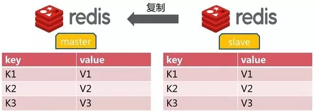
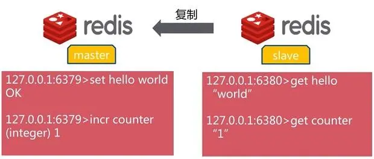
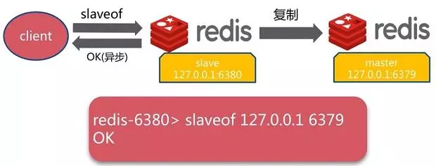
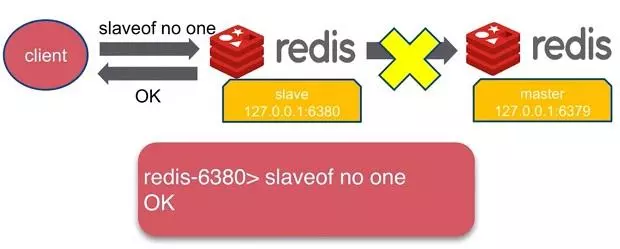
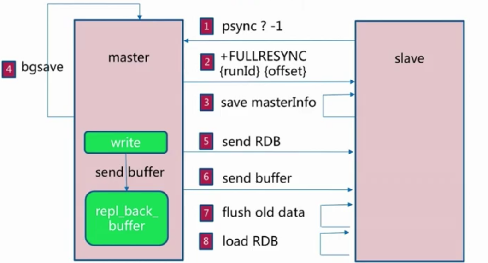
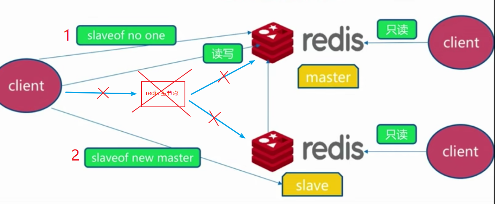

# 07、主从复制

### 什么是主从复制?

#### 单机有什么问题？

1. 机器故障（有可能丢失数据）
2. 容量瓶颈
3. QPS 瓶颈

#### 主从复制

如图 1 所示左边是Master节点，右边是slave节点，即主节点和从节点。从节点也是可以对外提供服务的，主节点是有数据的，从节点可以通过复制操作将主节点的数据同步过来，并且随着主节点数据不断写入，从节点数据也会做同步的更新。整体起到的就是数据备份的效果。



<center>图 1 一主一从</center>
#### 一主多从

redis还提供了一主多从的模型，也就是一个master可以有多个slave，也就相当于有了多份的数据副本。
 这样可以做一个更加高可用的选择，例如一个master和一个slave挂掉了，还能有其他的slave数据备份。


<center>图2 一主多从</center>
#### 读写分离

 除了作为数据备份，主从模型还能做另外一个功能，就是读写分离。 

让master节点负责提供写服务，而将数据读取的压力进行分流和负载，分摊给所有的从节点。



 <center>图3 读写分离</center>
#### 主从复制作用

- 数据副本 （数据备份）
- 扩展读性能 （读写分离）

#### 总结

- 一个 master 可以有多个 slave
- 一个slave 只能有一个 master
- 数据流是单向的，master 到 slave 

### 主从复制的配置

**两种方式配置主从复制：**

- slaveof 命令
- 修改配置文件

#### slaveof 命令

##### 配置主从复制

如图 4，想让 6380 成为 6379 的从节点，只需要 执行 `slaveof 127.0.0.1 6379`即可。 此复制命令是**异步进行的**，redis会自动进行后续数据复制的操作。



<center>图 4 slaveof 命令配置主从复制</center>
##### 取消主从复制

如图 5，如果6380节点不希望成为6379的从节点，可以执行 `slave of on one` 命令，取消后6380节点的数据不会被清除，只是说后续6379节点新写入的数据不会再同步到该节点了。

> 注意： 如果取消复制后想slave一个新的主节点，新的主节点在同步给slave节点数据时，会先将从节点的数据全部清除 



<center>图5 取消主从复制</center>
#### 配置文件

```shell
# 配置主节点的IP和端口号
slaveof ip port
 # 从节点只做读的操作，保证主从数据的一致性
slave-read-only yes 
```

#### 两种方式对比

| 方式 | 命令       | 配置               |
| ---- | ---------- | ------------------ |
| 优点 | 无需重启   | 统一配置，方便管理 |
| 缺点 | 不方便管理 | 需要重启           |

### runid 和 复制偏移量

redis每次启动的时候都会有一个随机的ID，作为一个标识，这个ID就是`runid`，当然重启之后值就改变了。

查看runid：`redis-cli -p 6379 info | grep run`

假如端口为6380的redis去复制6379，知道`runid`后，在6380上做一个标识，如果`runid`改变了，说明主可能重启了或者发生了其它变化，这时候就可以做一个全量复制把数据同步过来。或者第一次启动时根本不知道6379的`runid`，也会进行全量复制

偏移量：数据写入量的字节
比如主执行set hello world，就会有一个偏移量，然后从同步数据，也会记录一个偏移量。当两个偏移量达到一致时候，实际上数据就是完全同步的状态。 

启动主从redis，并在写入命令执行前后查看主偏移量：

```shell
redis-cli -p 6379 info replication | grep master_repl
```


 <center>图6 主节点查看偏移量</center>
从节点会向主节点做一个上报，把从节点的状态同步给主节点，这样主节点就知道了从节点的偏移量


<center>图7 主节点查看从节点偏移量</center>
生产环境我们一般不关心这个值，有时候做监控的时候会比对一下这两个值的差，如果差的太多，说明主从是有问题的。

### 全量复制

全量复制主节点会将RDB文件也就是当前状态去同步给slave，在此期间主新写入的命令会单独记录起来，然后当RDB文件加载完毕之后，会通过偏移量对比将这个期间产生的写入值同步给slave，这样就能达到数据完全同步的效果。

#### 全量复制过程



<center>图8 主从节点全复制过程</center>
详细过程如下：

1. 在其内部有一条命令`psync`，是做同步的命令，它可以完成全量复制和部分复制的功能，当启动slave节点时，它会发送`psync`命令给主节点，需要传递两个参数，`runid`和`offset`(偏移量)，也就是从向主传递主节点的runid以及自己的偏移量，对于第一次复制而言，就直接传递？和 -1，当然这个参数是由slave内部传的；
2. master接收到命令后知道从希望做全量复制，主就会将自己的runid和offset传递给从;
3. slave节点保存master的基本信息；
4. master执行`bgsave`生成RDB文件，并且在此期间新产生的写入命令会被记录到`repl_back_buffer`(复制缓冲区)；
5. 主向从传输RDB文件；
6. 主向从发送复制缓冲区内容
7. 清空从节点旧的数据
8. 从节点加载RDB文件到内存中，同时加载缓冲区数据

#### 全量复制开销

1. bgsave 时间 (对cpu、 内存、硬盘都会有一定的开销) 
2. RDB 文件网络传输时间 (网络带宽) 
3. 从节点清空数据时间 (根据从节点的数据规模) 
4. 从节点加载 RDB 的时间
5. 可能的 AOF 重写 时间(在最后从加载完RDB之后如果开启了AOF，会做AOF重写 )

### 部分复制

假如master和slave网络发生了抖动，那一段时间内这些数据就会丢失，对于slave来说这段时间master更新的数据是不知道的。最简单的方式就是再做一次全量复制，从而获取到最新的数据，在redis2.8之前是这么做的。

**在 redis 2.8之后有了部分复制机制**，如图 9


<center>图9 部分复制流程</center>
详细过程如下：

1. 如果发生了抖动，相当于连接断开了
2. 主会将写命令记录到缓冲区，repl_back_buffer
3. 当slave再次去连接master时候，就是说网络抖动结束之后，会触发增量复制
4. 从会执行pysnc命令，将当前自己的offset和主的runid传递给master
5. 如果发现传输的offset偏移量是在buffer内的，不在期间内就证明你已经错过了很多数据，buffer也是有限的，默认是1M，会将offset开始到队列结束的数据同步给从。这样master和slave就达到了一致。

通过部分复制(增量复制)有效的降低了全量复制的开销。

### 故障处理

#### 主从结构

- slave 宕掉

  

  <center> 图10 salve 节点发生故障转移</center>

- master 宕掉

  

  <center><center> 图11 master 节点发生故障转移</center></center>


### 开发与运维中的问题

#### 读写分离

- **读写分离**：读流量分摊到从节点。（优势）
- **可能遇到的问题**：
  - **复制数据延迟**。如果发生阻塞，会导致主从节点数据不一致。可以通过监控偏移量监控这个问题;
  - **读到过期的数据**（**redis 3.2已经解决了从节点读到过期数据**）
    - 两种删除过期数据的策略
      1. 懒惰策略，只有读到某个key 才会去检测
      2. 定时策略，启动定时任务检测key过期
    - 原因1：需要采样key是否过期，如果数据量大，时间就长，从节点来不及删除
    - 原因2：因为我们设置salve 节点是只读的，没有权限去删除数据。
- **从节点故障**（转移故障的成本还是比较高的）

#### 配置不一致

1. 例如 maxmenory不一致：可能丢失数据（如果从阶段的大小设置的比较小，从节点会进行数据的淘汰，这样就导致了主从不一致了）
2. 例如数据结构优化参数（例如hash-max-ziplist-entries）可能导致内存不一致

#### 规避全量复制

**为什么要规避？**

因为全量复制开销大。

**如何避免**

1. 第一次全量复制

   -  原因：第一次全量复制不可避免
   - 措施：使用小主节点、低峰（小节点，设置小的maxmenory这样 bgsave 开销小；低峰，在夜间进行）

2. 节点运行 ID 不匹配

   - 原因：主节点重启（运行ID 变化） 无法避免
   - 措施：故障转移，例如哨兵或者集群

3. 复制积压缓冲区

   - 原因：数据发生抖动(主从暂时断开了)
   - 增大复制缓冲区配置 rel_backlog_size，网络“增强”（理想的值=多少分钟*每分钟平局写入量）

#### 规避复制风暴

**什么是复制风暴？**

假设一个 master 节点挂了很多个从节点，我们的master 节点宕掉之后，重启。那么这个时候我们的从节点都需要进行做一个主从复制，因为runid已经发生改变了，所以master 的节点的开销非常大，在CUP、网络、硬盘开销大。

**单主节点复制风暴：**

- 问题：主节点重启，多从节点复制

- 解决：更换复制拓扑 (还是有问题的，如果 slave 1宕机了呢？) 如图12

  

  ​			<center>图12 主从节点转换成拓扑模式</center>

**单机复制风暴**

- 问题： 机器宕机后，大量全量复制（如图13）
- 解决：主节点分散机器


  		 <center>图13 单机多主节点</center>

