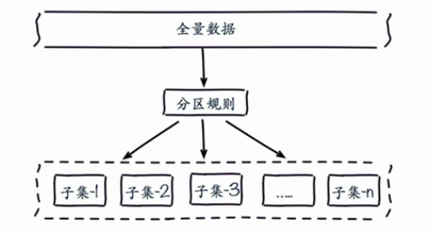
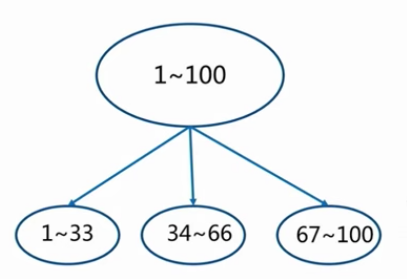
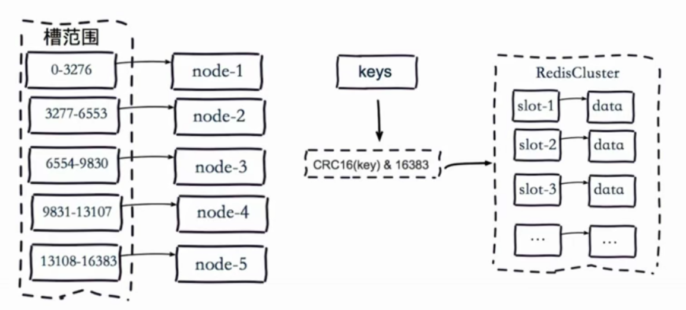
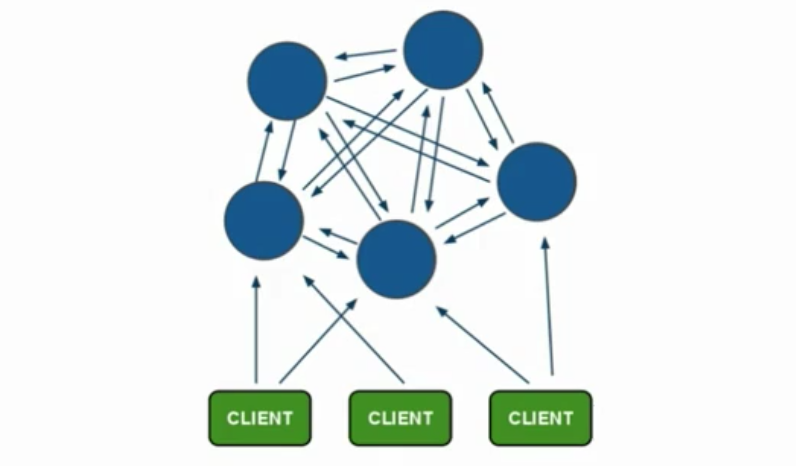

# Redis Cluster（1）

### 为什么需要集群？

**单机问题：**

- redis 官方说并发是10w/s，但是如果业务需要 100w/s?
- 单台物理机内存：16~256G，但是如果业务数据达到500G？
- 假设单机网络流量是1000M, 但是业务需要10G网络流量的时候？

**单机解决方法**：

- 升级物理机器，更大内存，更好网卡、最强 CPU，但是贵而且有瓶颈！（成本高）

**正确的解决方法：**

- 分布式：简单的认为就是加机器，将数据进行分区。（性价比高）

**集群：规模化需求**

- 并发量：QPS 高
- 数据量：大数据
- 网络流量：大

**那个版本提供集群支持？**

Redis Cluster is released in 3.0

### 数据分布

因为单机无法满足我们的业务需求，比如数据量大，QPS 高等情况，这是就要将数据按照一定规则分区。



<center>图 1 数据分布式</center>
#### 分区规则

- 顺序分区

  - 将数据顺序切分层 N 份数据，如果某个”依据“落在第M子集，那这份数据就存在M中。

  - 

    <center>图2 顺序分区</center>

- 哈希分区

  - 讲依据 key 进行 hash(key)%N  (其中n 就是代办分成 N 数据)
  - 

<center>图 3 hash 分区</center>
**对比**

<table border="1">
  <tr>
    <th>分布式方式</th>
    <th>特点</th>
    <th>典型产品</th>
  </tr>
  <tr>
    <td>哈希分布</td>
	<td>
    	<table>
            <tr>
            	<td>1、数据分散度高</td>
            </tr>  
            <tr>
            	<td>2、键值分布业务无关（因为加了hash 数据分散）</td>
            </tr> 
            <tr>
            	<td>3、无法顺序访问（因为加了hash 数据分散）</td>
            </tr> 
            <tr>
            	<td>4、支持批量操作</td>
            </tr> 
        </table>
    </td>
    <td>
    	<table>
            <tr>
            	<td>1、一致性哈希Memcache</td>
            </tr>  
            <tr>
            	<td>2、Redis Cluster</td>
            </tr> 
            <tr>
            	<td>3、其他缓存产品</td>
            </tr> 
        </table>  
    </td>
  </tr>
  <tr>
    <td>顺序分布</td>
    <td>
    	<table>
            <tr>
            	<td>1、数据分散度易倾斜（比如新老用户操作，老用户用的多，新用户用的少）</td>
            </tr>  
            <tr>
            	<td>2、键值业务相关</td>
            </tr> 
            <tr>
            	<td>3、可顺序访问（就是顺序分割，不影响顺序查找）</td>
            </tr> 
            <tr>
            	<td>4、不支持批量操作</td>
            </tr> 
        </table>
    </td>
    <td>
    	<table>
            <tr>
            	<td>1、Big Table</td>
            </tr>  
            <tr>
            	<td>2、HBase</td>
            </tr> 
        </table>
    </td>
  </tr>
</table>

#### 哈希分布

- 节点取余分区（客户端分片）
  - 公式：hash(key)%Nodes
  - 实现：
    - 对**分区的依据** key 进行哈希技术 hash(key) 
    - 假设分为 N 个区，那么 key 就会落在 hash(key)%N 这个区
  - 扩容：
    - 非翻倍扩容：数据迁移率大概是 70% ~ 80%
    - 翻倍扩容：数据迁移率是 50% 
  - 优缺点：
    - 优点：简单易操作
    - 缺点：
      - 节点伸缩：节点关系变化，导致数据迁移，（会导致缓存失效，导致数据库压力大）
      - 迁移数据和添加节点有关：建议翻倍扩容
      - 不建议使用这种方式

- 一致性哈希分区 （客户端分片）

  - hash(key)+顺时针(优化取余)

  - 实现：

    

    <center>图 5 一致性hash 实现方式</center>
- 如图5，先构造一个token环，数据范围为 0~2^32（其实就是 0<= hash(key)<=2^32）；
    - 为每一个节点添加一个token值，这个值是在token的范围内；
    - 假设 hash(key) 的值落在了 图5 中黄色的点上，他会顺时针的去找与之相近的节点。
    
- 扩容
  
  就是在 token 环中找一个合适的节点，如图6中的 n5
  
  
  
  <center>图6 一致性hash 扩容</center>
  - 数据依然会存在漂移，但是有一个好处就是影响面小，只会影响到 n1到 n2 的数据范围（特别是节点多的时候，假设是1000个，如果扩容一个节点 这样影响的数据就只有 1/1000）
  - 无法对数据进行迁移（无法将落在n1-n5之间的数据 从n2 迁移到 n5中）
    - 应用：节点比较多的情况性
    
  - 优缺点：

    - 实现简单： 客户端分片：hash(key)+顺时针（优化取余）
  - 节点伸缩：只影响邻近节点，但是还是有数据迁移
  
    - 翻倍伸缩：保证最小迁移数据和负载均衡

- 虚拟槽分区(Redis Cluster 采用的分区方式，服务端管理)

  - 实现：

    - 预设虚拟槽：每个槽映射一个数据子集（一般比节点数大。Redis Cluster是16383）
    - 操作：将 key 进行良好的哈希函数（CRC16）计算，之后在进行 16283取余，如果落在某个槽的范围内，就说明数据存储再该槽中
    - 函数： CRC16(key)%16383

  - 特点：服务端管理节点、槽、数据：例如 Redis Cluster

  - 原理：

    - Redis Cluster 虚拟槽实现原理如图7

    - 先将 16383 分配成 N 个节点（这里是5个），分别 0-3276 槽给 node-1 节点、3276 -6553 槽给 node-2 节点...等等（如图 7）

    - 然后 key 同过计算hash值（这里是 CRC16），再对 hash 值进行取余槽的范围，计算函数是 CRC16(key) % 16383。

    - 经过函数计算出来的值是 0-16383这个范围，假设值是 10 ，就落在了 node-1 节点上，就会发送消息给 node-1 节点咨询数据是否再 node-1 节点上：

      - 如果是，再对数据进行操作。
      - 如果不是，（因为 Redis Cluster 每个节点都是可以相互通信的,)就会返回数据所在的节点，在进行操作。
      - 这里可能会产生疑问，**为什么有可能不会在 node-1 节点上？**其实节点的伸缩就会导致个问题，前面也有提过，可自行推导。

      

      <center>图7 虚拟槽分配</center>

### 基本架构

#### 单机架构


<center>图 8 redis 单机架构</center>
如果可知，本质上就是1个Redis 进行读写操作（如果是主从模式就是一写多读）,性能上容易出现瓶颈。

#### 分布式架构



<center>图9 Reids分布式架构</center>
每个Redis 节点都是可以进行读写，这个依赖于每个节点都是可以相互通信的。（每个节点都负责数据中的一部分，因为可以通信，所有可以通知客户端我这个节点没有，你去某节点拿就是行了）

#### Redis Cluster 架构（安装）

- **节点**：Redis Cluster 中有一堆节点，每个节点都可以负责读写

  - 在配置上 Redis Cluster 于普通节点的的区别是多了一个配置 <font color='red'>`cluster-enabled:yes`</font>。

- **meet**：节点之间需要通信，meet 操作就是通信的基础

  - 如图10，节点 A meet 节点 C，节点 A 再 meet B。因为节点之间是可以相互通信的，所以 ，节点 B 和 节点 C 也是会建立通信连接，可以相互交换消息。

    

    <center>图 10 节点相互meet</center>

- **指派槽**：为每个节点指定槽的范围，这样才能对节点进行操作

  

  <center>图11 指派槽</center>

- **复制**：为了保证高可用，每个主节点都有一个从节点（内部不是用sentinel，通过节点通信来实现），主节点挂了，从节点顶上来。

### Redis Cluster 安装

#### 原生命令安装（理解架构）

- Cluster节点主要配置

  ```properties
  cluster-enabled yes  # 当前节点是 cluster 节点
  cluster-node-timeout 15000  #故障转移的时间或者是节点超时时间,15秒
  cluster-config-file "nodes.conf" #集群节点配置信息
  cluster-require-full-coverage yes #是否集群全部节点都是可用的，才对外提供服务,建议 no
  
  ```

- 配置节点(redis-${port}.conf)

  ```properties
  port ${port}
  daemonize yes
  dir "/opt/mydata/redis/bigdata"
  dbfilename "dump-${port}.rdb"
  logfile "${port}.log"
  cluster-enabled yes # 以集群的方式启动
  cluster-config-file nodes-${port}.conf #用来记录各个节点的配置
  ```

  开启节点的命令： redis-server redis-${port}.conf

- meet

  命令：<font color='red'>cluster meet ip port</font>

  ```shell
  redis-cli -h 127.0.0.1 -p 7000 cluster meet 127.0.0.1 7001 #7000节点meet7001
  ```

- 分配槽

  命令 <font color='red'>cluster addslots slot[slot ... ]</font>

  例如为 7000节点分配 0-5461 的槽

  ```she
  > redis-cli -h 127.0.0.1 -p 7000 cluster addslots 0
  > redis-cli -h 127.0.0.1 -p 7000 cluster addslots 2
  > ...
  > redis-cli -h 127.0.0.1 -p 7000 cluster addslots 5461
  ```

- 设置主从

  命令 <font color='red'> cluster replicate node-id</font>

  > 这里的 node-id 和 之前学过的 runId 是不懂，runId每次启动都是变化的，而node-id是不变的

  例如 7003节点 复制7000节点 （7000节点是主节点，7003是从节点）

  ```shell
  > redis-cli -h 127.0.0.1 -p 7003 cluster replicate ${node-id-7000}
  ```

  > 如何查看 node-id。前面我们配置了 `cluster-config-file nodes-${port}.conf` 。
  >
  > 可用通过 `cat nodes-${port}.conf` 查看 port 的 node id

#### redis-trib.rb安装方式（生产环境推荐）

##### Ruby环境装备

- 下载、编译、安装Ruby

  

- 安装 rubygem redis （ruby 客户端）

  

- 安装 redis-trib.rb 

  

##### 启动集群

- 文件配置和手动配置的一样

- 启动所有的节点

- 执行一键启动集群

  - 命令：<font color='red'>./redis-trib.rb create --replicat replicat_num master_ip:master_port[master_ip:master_port ...] salve_ip:salve_port[salve_ip:salve_port ...]</font>

    解释：

    - replicate_num:从节点的数据量。
    - master_ip/salve_ip:主/从节点ip
    - master_por/salve_portt:主/从节点端口

  - 例子

    ```shell
  ./redis-trib.rb create --replicat replicat_num 127.0.0.1:7000 127.0.0.1:7001 127.0.0.1:7002 127.0.0.1:7003 127.0.0.1:7004 127.0.0.1:7005
    ```
    
    就是7000-7005节点是个集群，其中 master 节点是 7000、7001、7002 ，salve节点是 7003、7004、7005
    
#### 两种安装方式对比

- 原生命令安装
  - 理解 Redis Cluster 架构
  - 生产环境不推荐使用
- 官方工具安装
  - 高效、准确
  - 生产环境可以使用
- 其他
  - 可视化部署

