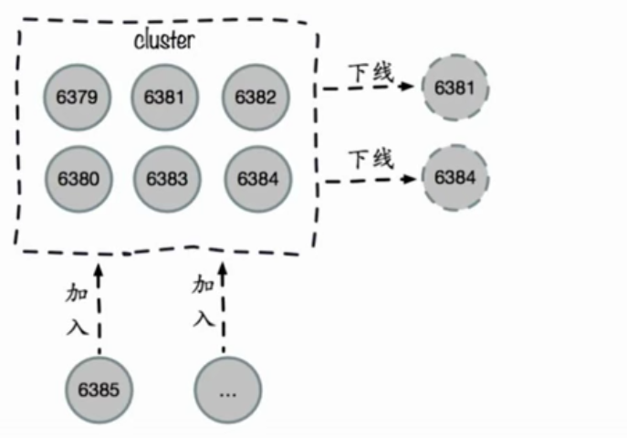

# Redis Cluster(2)

### 伸缩原理

图1 集群伸缩图

- 缩的情况：对6381和6384从节点中下线，将所管理的槽分配给集群中的节点。可能是因为节点异常或者其他情况。将

- 伸的情况：对6385节点加入集群中，集群中的节点抽出一部分slots 分配给新加入的节点。可能是扩容、或者替换某些异常节点的情况。

**集群伸缩的原理就是槽和数据在节点之间的移动 。**

### 扩容集群

### 缩容集群

