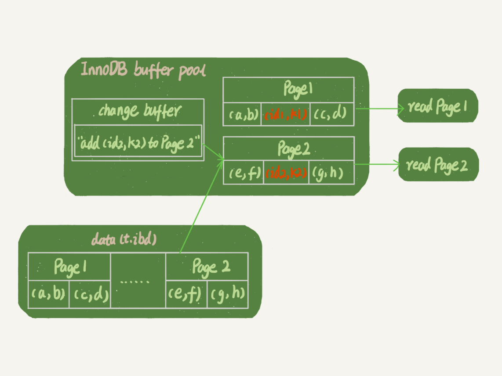

# 09 | 普通索引和唯一索引，应该怎么选择

例子：假设要维护一个市民系统，每个人都有一个唯一的身份证号，而且业务代码已经保证了不会写入两个重复的身份证号。如果市民系统需要按照身份证查询姓名，就会执行类似这样的 SQL 语句：

```mysql
select name from CUser where id_card = 'xxxxxxxyyyyyyzzzzz';
```

所以我们会考虑在 id_card 字段上建索引。

<font color="orange">由于身份证字段比较大，不建议把身份证号当做成主键</font>,那么现在就有两个选择，要么给 id_card 字段创建唯一索引，要么创建一个普通索引。如果业务代码上已经保证了不会出现重复的身份证号，那么这个两个选择逻辑上都是正确的。那要选择哪一个呢？

简单起见，我们还用第4章的例子来说明，假设字段k上的值都不重复（k 值假设是id_card 字段）。


<center>图1 InnoDB的索引组织结构</center>
我们来分析一下这两种索引在查询和更新的性能影响。

### 查询过程

假设执行的语句是 select id from T where k=5 。

- 对于普通索引来说，查找到满足条件的第一个记录（5，500）后，需要查找下一个记录，直到碰到第一个不满足 k=5 条件的记录。
- 对于唯一索引来说，由于索引定义了唯一性，查找到第一个满足条件的记录后，就会停止检索。

那么，这个不同带来的性能差距会有多少呢？答案是，微乎其微。

#### 分析

我们知道，InnoDB的数据是按照数据页为单位来读写的。也就说，当需要读一条记录的时候，并不是这个记录本身从磁盘读出来，而是以页为单位，将其整体读入内存。在InnoDB中，每个数据页的大小默认是16KB。

因为引擎是按页读写的，所以说，当找到k=5的记录的时候，它所在的数据就都在内存里了，那么对于普通索引来说，要多做的那一次“查找和判断下一条记录”的操作，就只需要一次指针寻找和第一计算。

当然，如果 k=5 这个记录刚好是这个数据页的最好一个记录，那么要取下一个记录，就必须读取下一个数据页，这个操作会稍微复制一些。

但是，我们也知道，对于整型字段，一个数据页可以放近千个key,因此这种情况的概率会很低，所以，我们计算性能差异时，仍然可以认为这个操作对于现在的CPU来说可以忽略不计。

### 更新过程

为了说明普通索引和唯一索引对更新语句性能的影响这个问题，我们必须先了解一个概念，change_buffer。

当需要更新一个数据页时，如果数据页在内存中就直接更新，而如果这个数据还没在内存中的话，在不影响数据一致性的前提下，InnoDB 会将这些更新操作缓存在change buffer 中，这样就不需要从磁盘中读取这个数据页了。在下次查询需要访问这个数据页的时候，将数据页读入内存，然后执行change buffer 中与这个页有关的操作。通过这种方式就能保证整个数据逻辑的正确性。

>需要说明的是，虽然名字叫做 change buffer ，实际上它是可以持久化的数据。也就是说，**change buffer 在内存中有拷贝，也是会被写入到磁盘中的**。

将 change buffer 中的操作应用到原数据页，得到最新的过程称之为merge。除了访问这个数据页会触发merge外，系统有后台线程会定期merge。在数据库正常关闭(shutdown)的过程中，也是会执行merge操作。

显然，如果能够将更新操作先记录在change buffer ，减少读磁盘，语句执行速度会得到明显的提升。而且，数据读入内存是需要占用 buffer pool 的，所以这种方式还能避免占用内存，提高内存利用率。

### 什么条件下可以使用 change buffer ?

对于唯一索引来说，所有的更新操作都要先判断这个操作是违反唯一性约束。比如，要插入（4，400）这个记录，就要先判断现在表中是否已经存在 k=4 的记录，而这必须要将数据页读入内存才能判断。如果都已经读入到内存了，那直接更新内存会更快，就没必要使用 change buffer 了。

**因此，唯一索引的更新就不能使用 change buffer，实际上也只有普通索引可以使用**。

change buffer 用的是 buffer pool 里的内存，因此不能无限增大。change buffer 的大小，可以通过参数 innodb_change_buffer_max_size 来动态设置。这个参数设置为50的时候，表示 change buffer 的大小最多只能占用 buffer pool 的 50%。

现在，你已经理解了 change buffer 的机制，那么我们再一起来看看**如果要在这张表中插入一个新记录（4，400）的话，innoDB的处理流程是怎样的。**

第一种情况是，**这个记录要更新的目标页在内存中**。这时，InnoDB 的处理流程如下：

- 对于唯一索引来说，找到3和5之间的位置，**判断到没有冲突**，插入这个值，语句执行结束；
- 对于普通索引来说，找到3和5之间的位置，插入这个值，语句执行结束。

第二种情况是，**这个记录要更新的目标不在内存中**。这时，InnoDB的处理流程如下：

- 对于唯一索引来说，需要将数据页读入内存，判断到没有冲突，插入这个值，语句执行结束；
- 对于普通索引来说，则是将更新记录在change buffer，语句就执行结束了。

将数据从磁盘读入内存涉及随机IO的访问，时数据库里面成本最高的操作之一。change buffer 因为减少了随机访问磁盘访问，所以对更新性能的提升会很明显的。

> 例子： 之前我就碰到过一件事儿，有个 DBA 的同学跟我反馈说，他负责的某个业务的库内存命中率突然从 99% 降低到了 75%，整个系统处于阻塞状态，更新语句全部堵住。而探究其原因后，我发现这个业务有大量插入数据的操作，而他在前一天把其中的某个普通索引改成了唯一索引。

### change buffer 的使用场景

merge 的时候是真正进行数据更新的时刻，而change buffer 的主要目的就是将记录变更动作缓存下来，所以在一个数据页做merge之前，change buffer 记录的变更越多，收益越大。

因此,**对于写多读少的业务来说，页面在写完以后马上被访问到的概率比较小，因此change buffer 的使用效果最好。这业务模型常见的就是账单类、日志类的系统。**

> 反例:假设一个业务的更新模式是写入之后马上会做查询，那么即使满足了条件，将更新先记录在 change buffer，但之后由于马上要访问这个数据页，会立即触发 merge 过程。这样随机访问 IO 的次数不会减少，反而增加了 change buffer 的维护代价。所以，对于这种业务模式来说，change buffer 反而起到了副作用。

### 索引选择与实践

回到我们文章开头的问题，普通索引和唯一索引应该怎么选择。其实，这两类索引在查询能力上是没差别的，主要考虑的是对更新性能的影响。所以，我建议你尽量选择普通索引。

如果所有的更新后面，都马上伴随着对这个记录的查询，那么你应该关闭 change buffer。而在其他情况下，change buffer 都能提升更新性能。

在实际使用中，你会发现，普通索引和 change buffer 的配合使用，对于数据量大的表的更新优化还是很明显的。特别地，在使用机械硬盘时，change buffer 这个机制的收效是非常显著的。所以，当你有一个类似“历史数据”的库，并且出于成本考虑用的是机械硬盘时，那你应该特别关注这些表里的索引，尽量使用普通索引，然后把 change buffer 尽量开大，以确保这个“历史数据”表的数据写入速度。

#### change buffer 和 redo log

理解了change buffer 的原理，你可能会联想到我在面前文章中和你介绍过的 redo log 和 WAL。

在前面文章的评论中，我发现有同学混淆了 redo log 和 change buffer 。WAL 提升性能 的核心机制，也的确是尽量减少随机读写，这两个概念确实容易混淆。所以，这里我把它们放到了同一个流程里来说明，便于你区分这个两个概念。

现在，我们要在表上执行这个插入语句：

```mysql
mysql> insert into t(id,k) values(id1,k1),(id2,k2);
```

这里，我们假设当前 k 索引树的状态，查找到位置后，k1 所在的数据页在内存（InnoDB buffer pool）中。k2 所在的数据页不在内存中。如图2所示是带 change buffer 的更新状态图。


<center>图2 带 change buffer的更新过程</center>
分析这条更新语句，你会发现它涉及了四个部分：内存、redo log（ib_log_fileX）、数据表空间（t.ibd）、系统表空间（ibdata1）。

这条更新语句做了如下的操作（按照图中的数据顺序）：

1. Page1 在内存中，直接更新内存；
2. Page2 没有在内存中，就在内存的change buffer 区域，记录下 “我要往Page2 插入一行” 这个信息；
3. 将上述两个动作记入 redo log 中 （图中 3 和 4）。

做完上面这些，事务就可以完成了。所以，你会看到，执行这条更新语句的成本很低，就写了两处内存，然后写了一处磁盘（两次操作合在一起写了一次磁盘），而且还是顺序写的。

同时，图中的两个虚拟箭头，是后台操作，不影响更新的响应时间。

比如，我们现在要执行 select * from t where k in (k1,k2)。下图是这两个读请求的流程图。

如果读语句发生在更新语句后不久，内存中的数据都还在，那么此时的这两个读操作就与系统表空间（ibdata1）和 redo log（ib_log_fileX）无关了。所以，在图中就没与画出这两部分。



<center> 图3 带change buffer的读过程</center>
从图中可以看到：

1. 读Page1的时候，可以直接从内存返回。可以看一下图3的这个状态，虽然磁盘上还是之前的数据，但是这里直接从内存返回结果，结果是正确的。
2. 要读Page2的时候，需要把Page2从磁盘读入内存中，然后应用change buffer 里面的操作日志，生成一个正确的版本并返回结果。可以看到，直到需要读Page2的时候，这个数据页才会被读入内存。

所以，如果要简单地对比这两个机制在提升更新性能上的收益的话，**redo log 主要节省的是随机写磁盘的IO消耗（转成顺序写），而change buffer 主要节省的则是随机读磁盘的IO消耗**。

