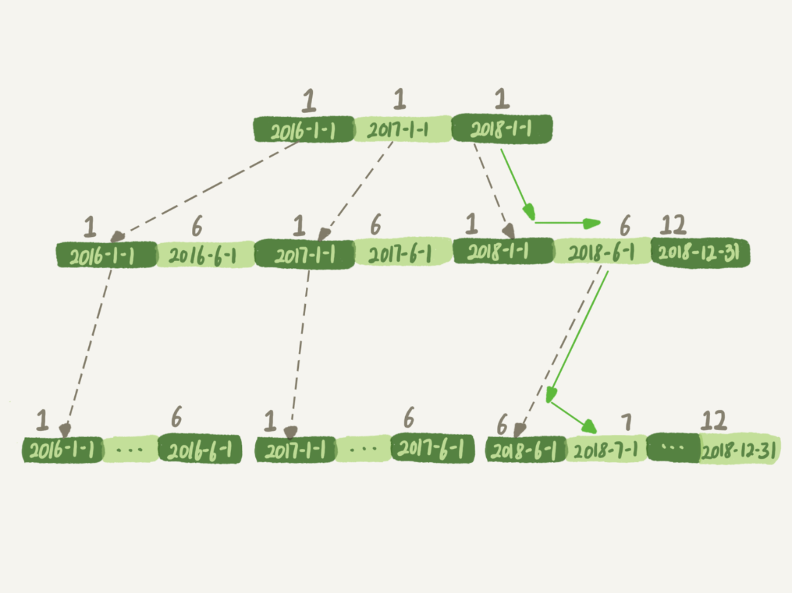
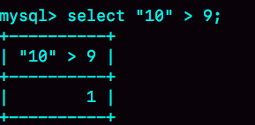
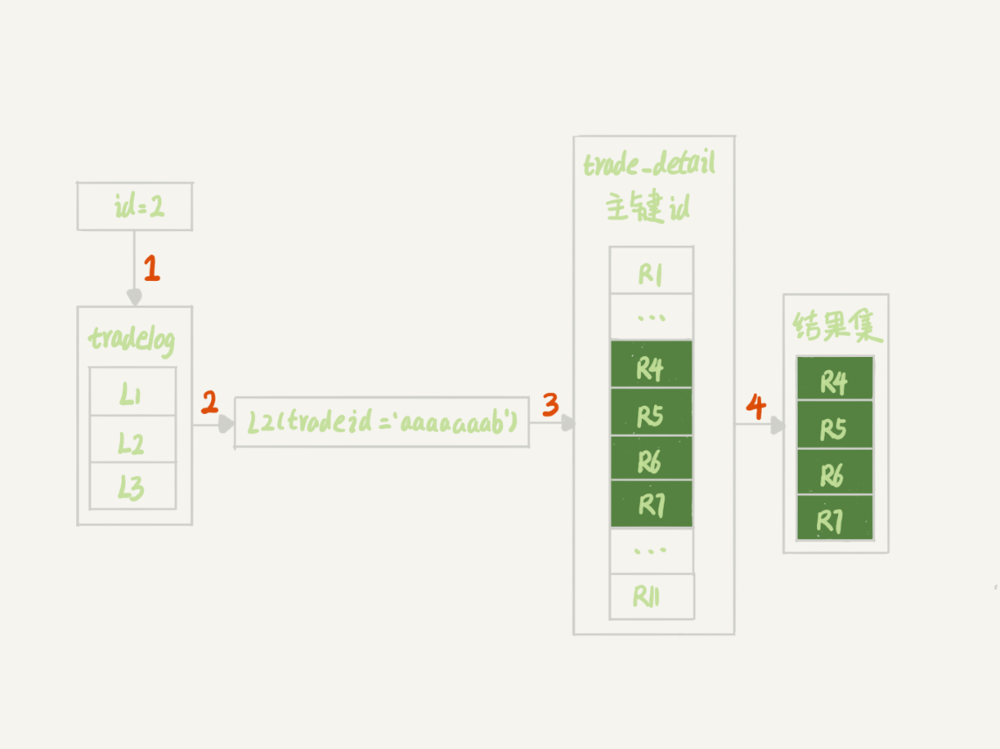

# 18 | 为什么这些SQL语句逻辑相同，性能却差异巨大？

假设你现在维护了一个交易系统，其中交易记录表 tradelog 包含交易流水号 （tradeid）、交易员id （operator）、交易时间（t_modified）等字段。建表语句如下：

```mysql
mysql> CREATE TABLE `tradelog` (
  `id` int(11) NOT NULL,
  `tradeid` varchar(32) DEFAULT NULL,
  `operator` int(11) DEFAULT NULL,
  `t_modified` datetime DEFAULT NULL,
  PRIMARY KEY (`id`),
  KEY `tradeid` (`tradeid`),
  KEY `t_modified` (`t_modified`)
) ENGINE=InnoDB DEFAULT CHARSET=utf8mb4;
```

假设，现在表中已经记录了从2016到2018年的所有数据。

## 案例一：条件字段函数操作

现在，有一个需求是要统计发生再所以年份中7月份的交易总数。你的SQL 可能会这样写：

```mysql
mysql> select count(*) from tradelog where month(t_modified)=7;
```

由于 t_modified 字段已经加索引，你想执行速度应该很快。然而，在实际的生产库中执行这条语句，却发现执行地很久，才返回结果。

如果你百度查询这个现象，可能会有人告诉你，如果对字段做函数计算，就用不上索引了，这是 MySQL 的规定。

为什么会有这样的规定？ 原理是什么？为什么条件是 where t_modified='2018-7-1’的时候可以用上索引？

好的，我们看一下 这个 t_modified 索引示意图。



<center>图 1 t_modified 索引示意图</center>
在索引那章我们学过， 如果你的 SQL 语句条件用的是 where t_modified='2018-7-1’的话，引擎就会按照上面绿色箭头的路线，快速定位到 t_modified='2018-7-1’需要的结果。

**实际上，B+ 树提供的这个快速定位能力，来源于同一层兄弟节点的有序性。**

而如果用 month() 函数的话，我们传入 7 的时候，在树的第一层就不知道该怎么办了。

也就是说，**对索引字段做函数操作，可能会破坏索引值的有序性，因此优化器就决定放弃走树搜索功能。**

**需要注意的时，优化器并不是放弃要使用这个索引**。

在这个例子中，放弃树搜索功能，优化器可以选择遍历主键索引，也可以选择遍历索引 t_modified,优化器会对比两个索引的大小，从而选择更小的 t_modified 索引，提升性能。

接下来，我们使用 explain 命令，查看一下这条 SQL 语句的执行结果。


<center>图 2 explain 结果</center>
key="t_modified"表示的是，使用了 t_modified 这个索引；我在测试表数据中插入了 10 万行数据，rows=100335，说明这条语句扫描了整个索引的所有值；**Extra 字段的 Using index，表示的是使用了覆盖索引。**

那么如何优化这条 SQL呢?  那就分段改成范围查询 SQL 如下：

```mysql
mysql> select count(*) from tradelog where
    -> (t_modified >= '2016-7-1' and t_modified<'2016-8-1') or
    -> (t_modified >= '2017-7-1' and t_modified<'2017-8-1') or 
    -> (t_modified >= '2018-7-1' and t_modified<'2018-8-1');
```

另外，**对索引字段运算操作，也是无法使用索引的**，如

```mysql
mysql> select * from tradelog where id + 1 = 10000
```


## 案例二：隐式类型转换

这个问题，我前段时间也是碰到过，幸好看了 林晓斌 大佬的这篇文章，快速定位到问题。

回到正文，看一下下面这条 SQL 语句：

```mysql
mysql> select * from tradelog where tradeid=110717;
```

在表结构中我们已经定义了 tradeid 索引，不幸的是，explain 的结果显示，这条语句需要走全表扫描（那这样索引的意义何在？ 不要着急），我们发现，表结构定义的时候，tradeid 的类型是 varchar(32),而输入的参数却是整型，所以需要做类型转换。

那么，现在这里就有两个问题？

1. 数据类型转换的规则是什么？
2. 为什么有数据类型转换，就要走全索引扫描？

先来看第一个问题，你可能会说，数据库里面类型这么多，这种数据类型转换规则更多，我记不住，应该怎么办呢？ 

这里有一个简单的方法，看 select “10” > 9 的结果： 

1. 如果规则是“将字符串转成数字”，那么就是做数字比较，结果应该是 1； 
2. 如果规则是“将数字转成字符串”，那么就是做字符串比较，结果应该是 0。



<center>图 3 MySQL 中字符串和数字转换的效果示意图</center>
从图中可知，select “10” > 9 返回的是 1，所以你就能确认 MySQL 里的转换规则了：在 MySQL 中，字符串和数字做比较的话，是将字符串转换成数字。

就知道对于优化器来说，这个语句相当于：

```msyql
mysql> select * from tradelog where  CAST(tradid AS signed int) = 110717;
```

也就是说，这条语句触发了我们上面说到的规则：对索引字段做函数操作，优化器会放弃走树搜索功能。


##  案例三：隐式字符编码转换 

假设，系统里还有另外一个表 trade_detail,用于记录交易操作细节， 为了便于量化分析和复现，我往交易日志表 tradelog 和交易详情表 trade_detail 这两个表里插入一些数据。

```mysql

mysql> CREATE TABLE `trade_detail` (
  `id` int(11) NOT NULL,
  `tradeid` varchar(32) DEFAULT NULL,
  `trade_step` int(11) DEFAULT NULL, /*操作步骤*/
  `step_info` varchar(32) DEFAULT NULL, /*步骤信息*/
  PRIMARY KEY (`id`),
  KEY `tradeid` (`tradeid`)
) ENGINE=InnoDB DEFAULT CHARSET=utf8;

insert into tradelog values(1, 'aaaaaaaa', 1000, now());
insert into tradelog values(2, 'aaaaaaab', 1000, now());
insert into tradelog values(3, 'aaaaaaac', 1000, now());

insert into trade_detail values(1, 'aaaaaaaa', 1, 'add');
insert into trade_detail values(2, 'aaaaaaaa', 2, 'update');
insert into trade_detail values(3, 'aaaaaaaa', 3, 'commit');
insert into trade_detail values(4, 'aaaaaaab', 1, 'add');
insert into trade_detail values(5, 'aaaaaaab', 2, 'update');
insert into trade_detail values(6, 'aaaaaaab', 3, 'update again');
insert into trade_detail values(7, 'aaaaaaab', 4, 'commit');
insert into trade_detail values(8, 'aaaaaaac', 1, 'add');
insert into trade_detail values(9, 'aaaaaaac', 2, 'update');
insert into trade_detail values(10, 'aaaaaaac', 3, 'update again');
insert into trade_detail values(11, 'aaaaaaac', 4, 'commit');
```

这时候，如果要查询id=2 的交易的所有操作步骤信息，SQL 语句可以这么写：

```mysql
mysql> select d.* form tradelog l,trade_detail d where d.tradeid=l.tradeid and l.id=2;
```

我们一起来看下这个结果：

1. 第一行显示优化器会先在交易记录表tradelog 上查到id=2的行，这个步骤用上主键索引，rows=1 表示只扫描一行；
2. 第二行 key=NULL ，表示没有用上交易详情表 trade_detail 上索引，进行了全表扫描。

在这个执行计划里，是从 tradelog 表中取 tradeid 字段，再去 trade_detail 表里查询匹配字段。因此，我们把 tradelog 称为驱动表，把 trade_detail 称为被驱动表，把 tradeid 称为关联字段。

接下来，我们看下这个 explain 结果表示的执行流程：



<center> 图 4 语句 Q1 的执行过程 </center>
图中：

- 第一步，是根据 id 在 tradelog 表里找到 L2 这一行；
- 第二步， 是从 L2 中取出 tradeid 字段的值；
- 第三步，是根据 tradeid 值到 trade_detail 表中查找条件匹配的行。explain 的结构里面第二行的key=NULL 表示的就是，这个过程是通过遍历主键索引的方式，一个一个地

进行到这里，你会发现第 3 步不符合我们的预期。因为表 trade_detail 里 tradeid 字段上是有索引的，我们本来是希望通过使用 tradeid 索引能够快速定位到等值的行。但，这里并没有。

其实我们仔细看的话，已经知道问题了，就是因为这两个表的字符集不同，一个是utf8，一个是utf8mb4，所以做表连接查询的时候用不上关联字段的索引。

 为什么字符集不同就用不上索引呢？ 

 我们说问题是出在执行步骤的第 3 步，如果单独把这一步改成 SQL 语句的话，那就是： 

```mysql
mysql> select * from trade_detail where tradeid=$L2.tradeid.value;
```

其中，$L2.tradeid.value 的字符集是 utf8mb4。 

参照前面的两个例子，你肯定就想到了，字符集 utf8mb4 是 utf8 的超集，所以当这两个类型的字符串在做比较的时候，MySQL 内部的操作是，先把 utf8 字符串转成 utf8mb4 字符集，再做比较。

因此， 在执行上面这个语句的时候，需要将被驱动数据表里的字段一个个地转换成 utf8mb4，再跟 L2 做比较。

也就是说，实际上这个语句等同于下面这个写法： 

```mysql
select * from trade_detail  where CONVERT(traideid USING utf8mb4)=$L2.tradeid.value; 
```

CONVERT() 函数，在这里的意思是把输入的字符串转成 utf8mb4 字符集。 

这就再次触发了我们上面说到的原则：对索引字段做函数操作，优化器会放弃走树搜索功能。

到这里，你终于明确了，字符集不同只是条件之一，**连接过程中要求在被驱动表的索引字段上加函数操作，是直接导致对被驱动表做全表扫描的原因**。

作为对比验证，我给你提另外一个需求，“查找 trade_detail 表里 id=4 的操作，对应的操作者是谁”，再来看下这个语句和它的执行计划。

```msyql
mysql>select l.operator from tradelog l , trade_detail d where d.tradeid=l.tradeid and d.id=4;
```


<center> 图 6 explain 结果 </center>
 这个语句里 trade_detail 表成了驱动表，但是 explain 结果的第二行显示，这次的查询操作用上了被驱动表 tradelog 里的索引 (tradeid)，扫描行数是 1。 

这也是两个 tradeid 字段的 join 操作，为什么这次能用上被驱动表的 tradeid 索引呢？我们来分析一下。

假设驱动表 trade_detail 里 id=4 的行记为 R4，那么在连接的时候（图 4 的第 3 步），被驱动表 tradelog 上执行的就是类似这样的 SQL 语句

```mysql
select operator from tradelog  where traideid =$R4.tradeid.value; 
```

这时候 $R4.tradeid.value 的字符集是 utf8, 按照字符集转换规则，要转成 utf8mb4，所以这个过程就被改写成： 

```mysql
select operator from tradelog  where traideid =CONVERT($R4.tradeid.value USING utf8mb4); 
```

你看，这里的 CONVERT 函数是加在输入参数上的，这样就可以用上被驱动表的 traideid 索引。

理解了原理以后，就可以用来指导操作了。如果要优化语句 

- 比较常见的优化方法是，把 trade_detail 表上的 tradeid 字段的字符集也改成 utf8mb4，这样就没有字符集转换的问题了。

  ```mysql
  alter table trade_detail modify tradeid varchar(32) CHARACTER SET utf8mb4 default null;
  ```

- 如果能够修改字段的字符集的话，是最好不过了。但如果数据量比较大， 或者业务上暂时不能做这个 DDL 的话，那就只能采用修改 SQL 语句的方法了。 

  ```mysql
  mysql> select d.* from tradelog l , trade_detail d where d.tradeid=CONVERT(l.tradeid USING utf8) and l.id=2; 
  ```

## 总结

其实这三个案例都是在说一件事情，即 **对索引字段做函数操作，可能会破坏索引值的有序性，因此优化器就决定放弃走树搜索功能**。优化的手段也比较明显，第一种是修改成为同个类型的数据个数或者编码等，第二种是在输入或者驱动表字段通过函数转化成与之相同的格式即可。
