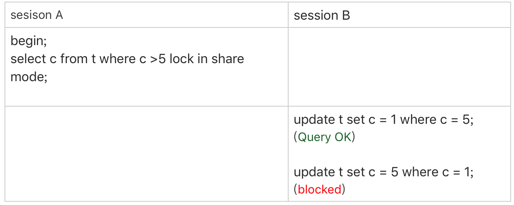
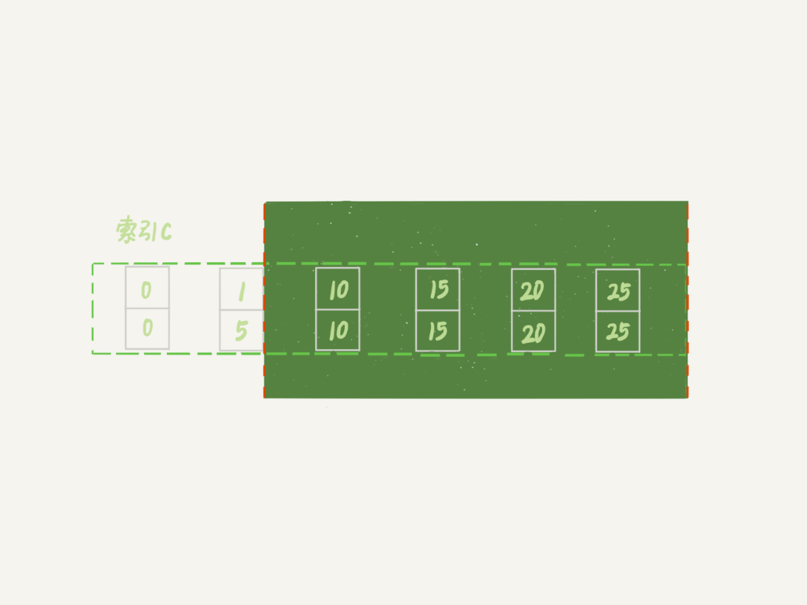

# 21 | 为什么我只改一行的语句，锁这么多？

以下规则的前提：

1. MySQL 后面的版本可能会改变加锁策略，所以这个规则只限于截止到现在的最新版本，即 5.x 系列 <=5.7.24，8.0 系列 <=8.0.13。
2. **因为间隙锁在可重复读隔离级别下才有效**， 所以本篇文章接下来的描述，若没有特殊说明，默认是可重复读隔离级别。 

**加锁规则里面，包含了两个“原则”、两个“优化” 和一个“bug”**

1. 原则1：加锁的基本单位是 next-key lock（有间隙锁+行锁，间隙锁是前开后开，行锁是锁一行，所以 next-key lock 是前开后闭区间）
2. 查找过程中访问到的**对象**才会加锁。
3. 优化 1 ：索引上的等值查询，**给唯一索引加锁的时候**，next-key lock 退化成为行锁。
4. 优化 2：索引上的等值查询，会向右遍历时且最后一个值不满足等值条件的时候（才会停），next-key lock 退化为间隙锁。
5. 一个bug：唯一索引上的范围查询会访问到不满足条件的第一个值为止

表 t 的建表语句和初始化语句如下。

```mysql
CREATE TABLE `t` (
  `id` int(11) NOT NULL,
  `c` int(11) DEFAULT NULL,
  `d` int(11) DEFAULT NULL,
  PRIMARY KEY (`id`),
  KEY `c` (`c`)
) ENGINE=InnoDB;

insert into t values(0,0,0),(5,5,5),
(10,10,10),(15,15,15),(20,20,20),(25,25,25);
```

## 案例一：等值查询间隙锁

第一个例子是关于等值条件操作间隙：


<center>图 1 等值查询的间隙锁</center>
由于表 t 中没有 id=7 的记录，所以用我们上面提到的加锁规则判断一下的话：

1. 根据原则 1 ，加锁单位是 next-key lock，session A 加锁范围就是（5，10];
2. 同时根据优化 2，这是一个等值查询（id=7）,而 id=10 不满足查询条件，next-key lock 退化成为间隙锁，因此最终加锁的范围是（5，10）。

所以，session B 要往这个间隙里面插入 id=8 的记录会被锁住，但是 session C 修改 id=10 这行是可以的。

## 案例二： 非唯一索引等值锁

第二个例子是关于覆盖索引上的锁：


<center>图 2 只加在非唯一索引上的锁</center>
看到这个例子，真的有一种“该锁的不锁，不该锁的乱锁”的感觉？ 我们来分析一下吧。 

这里 session A 要给索引 c 上 c=5 这一行加上读锁。

1. 根据 原则1，加锁单位是 next-key lock，因此会给（0，5]加上 next-key lock。
2. 要注意 c 是普通索引，根据优化2，仅访问 c=5 这一条记录是不能马上停下来的，需要向右遍历，查到 c=10 才放弃。而根据原则2，访问到的都要加锁，因此要给（5，10 ]加 next-key lock。
3. 又根据优化2，等值判断，向右遍历，最后一个值不满足 c=5 这个等值条件，因此退化成间隙锁 (5,10)。
4. 根据原则2，只有访问到的对象才会加锁，这个查询使用覆盖索引，并不需要访问主键索引，所以主键索引上没有任何加锁，这就是为什么session B 的update 语句可以执行完成。

但 session C 要插入一个（7，7，7）的记录，就会被 session A 的间隙锁（5，10）锁住。

需要注意，在这个例子中，lock in share mode 只锁覆盖索引，但是如果 for update 就不一样了。执行for update 时，系统会认为你接下来要更新数据，因此会顺便给主键索引上满足条件的行加上行锁。

这个例子说明，锁是加在索引上的；同时，它给我们指导是，如果你要用lock in share mode 来给行加读锁避免数据被更新的话，就必须绕过覆盖索引的优化，在查询字段中加入索引中不存在的字段，比如将 session A 的查询语句改成 select id,d from t where c=5 lock in share mode。

## 案例三：主键索引范围锁

第三个例子是关于范围查询的。

举例之前，你可以先思考一下这个问题：对于我们这个表 t，下面这两条查询语句，加锁范围相同吗？

```mysql
mysql> select * from t where id=10 for update;
mysql> select * from t where id>=10 and id<11 for update;
```

在逻辑三，这两条语句肯定是等价的，但是他们的加锁规则不太一样。现在我们就让 session A 执行第二个查询语句，来看看加锁效果。


<center> 图 3 主键索引上范围查询的锁 </center>
现在我们就用前面提到的加锁规则，来分析一下 session A 会加什么锁呢？

1. 开始执行的时候，要找到第一个 id=10 的行，因此本该是 next-key lock （5，10]。根据优化1，主键 id 上的等值条件，退化成为行锁，只加了 id=10 这一行的行锁。
2. 范围查找就要往后继续找，找到 id=15 这一行停下来，因此需要加next-key lock （10，15]。

所以，session A 这时候锁住的范围就是主键索引上，行锁 id=10 和 next-key lock （10，15]。

需要注意一点，首次 session A 定位查找 id=10 的行的时候，是当做等值查询来判断的，而向右扫描到 id=15 的时候，用的是范围查询判断。

## 案例四：非唯一索引范围锁

接下来，我们再看两个范围查询加锁的例子，你可以对照着案例三来看。 

需要注意的是，与案例三不同的是，案例四中查询语句的 where 部分用的是字段 c。


<center> 图 4 非唯一索引范围锁 </center>
这次 session A 用字段 c 来判断，加锁规则跟案例三唯一的不同是：在第一次用 c=10 定位记录的时候，索引 c 上加了 (5,10]这个 next-key lock 后，由于索引 c 是非唯一索引，没有优化规则，也就是说不会蜕变为行锁，因此最终 sesion A 加的锁是，索引 c 上的 (5,10] 和 (10,15] 这两个 next-key lock。

所以从结果上来看，sesson B 要插入（8,8,8) 的这个 insert 语句时就被堵住了。

这里需要扫描到 c=15 才停止扫描，是合理的，因为 InnoDB 要扫到 c=15，才知道不需要继续往后找了。

## 案例五：唯一索引范围锁 bug

前面的四个案例，我们已经用到了加锁规则中的两个原则和两个优化，接下来再看一个关于加锁规则中 bug 的案例。 


<center>图 5 唯一索引范围锁的 bug</center>
session A 是一个范围查询，按照原则 1 的话，应该是索引 id 上只加 (10,15]这个 next-key lock，并且因为 id 是唯一键，所以循环判断到 id=15 这一行就应该停止了。

但是实现上，InnoDB 会往前扫描到第一个不满足条件的行为止，也就是 id=20。而且由于这是个范围扫描，因此索引 id 上的 (15,20]这个 next-key lock 也会被锁上。

所以你看到了，session B 要更新 id=20 这一行，是会被锁住的。同样地，session C 要插入 id=16 的一行，也会被锁住。

照理说，这里锁住 id=20 这一行的行为，其实是没有必要的。因为扫描到 id=15，就可以确定不用往后再找了。但实现上还是这么做了，因此我认为这是个 bug。

## 案例六：非唯一索引上存在"等值"的例子

接下来的例子，是为了更好地说明“间隙”这个概念。这里，我给表 t 插入一条新记录。

```msyql
mysql> insert into t values(30,10,30);
```

新插入的这一行 c=10，也就是说现在表里有两个 c=10 的行。那么，这时候索引 c 上的间隙是什么状态了呢？你要知道，由于非唯一索引上包含主键的值，所以是不可能存在“相同”的两行的。


<center> 图 6 非唯一索引等值的例子 </center>
可以看到，虽然有两个 c=10，但是它们的主键值 id 是不同的（分别是 10 和 30），因此这两个 c=10 的记录之间，也是有间隙的

图中我画出了索引 c 上的主键 id。为了跟间隙锁的开区间形式进行区别，我用 (c=10,id=30) 这样的形式，来表示索引上的一行。

现在，我们来看一下案例六。

这次我们用 delete 语句来验证。注意，delete 语句加锁的逻辑，其实跟 select ... for update 是类似的，也就是我在文章开始总结的两个“原则”、两个“优化”和一个“bug”。


<center>图 7 delete 示例</center>
这时，session A 在遍历的时候，先访问第一个 c=10 的记录。同样地，根据原则 1，这里加的是 (c=5,id=5) 到 (c=10,id=10) 这个 next-key lock。

然后，session A 向右查找，直到碰到 (c=15,id=15) 这一行，循环才结束。根据优化 2，这是一个等值查询，向右查找到了不满足条件的行，所以会退化成 (c=10,id=10) 到 (c=15,id=15) 的间隙锁。

也就是说，这个 delete 语句在索引 c 上的加锁范围，就是下图中蓝色区域覆盖的部分。


<center>图 8 delete 加锁效果示例</center>
这个蓝色区域左右两边都是虚线，表示开区间，即 (c=5,id=5) 和 (c=15,id=15) 这两行上都没有锁。

## 案例七：limit 语句加锁

例子 6 也有一个对照案例，场景如下所示：


<center>图 9 limit 语句加锁</center>
这个例子里，session A 的 delete 语句加了 limit 2。你知道表 t 里 c=10 的记录其实只有两条，因此加不加 limit 2，删除的效果都是一样的，但是加锁的效果却不同。可以看到，session B 的 insert 语句执行通过了，跟案例六的结果不同。

这是因为，案例七里的 delete 语句明确加了 limit 2 的限制，因此在遍历到 (c=10, id=30) 这一行之后，满足条件的语句已经有两条，循环就结束了。

因此，索引 c 上的加锁范围就变成了从（c=5,id=5) 到（c=10,id=30) 这个前开后闭区间，如下图所示：


<center> 图 10 带 limit 2 的加锁效果 </center>
可以看到，(c=10,id=30）之后的这个间隙并没有在加锁范围里，因此 insert 语句插入 c=12 是可以执行成功的。

这个例子对我们实践的指导意义就是，**在删除数据的时候尽量加 limit**。这样不仅可以控制删除数据的条数，让操作更安全，还可以减小加锁的范围。

## 案例八：一个死锁的例子

前面的例子中，我们在分析的时候，是按照 next-key lock 的逻辑来分析的，因为这样分析比较方便。最后我们再看一个案例，目的是说明：next-key lock 实际上是间隙锁和行锁加起来的结果。


<center> 图 11 案例八的操作序列 </center>
现在，我们按时间顺序来分析一下为什么是这样的结果。 

1. session A 启动事务后执行查询语句加 lock in share mode，在索引 c 上加了 next-key lock(5,10] 和间隙锁 (10,15)；
2. session B 的 update 语句也要在索引 c 上加 next-key lock(5,10] ，进入锁等待； 
3. 然后 session A 要再插入 (8,8,8) 这一行，被 session B 的间隙锁锁住。由于出现了死锁，InnoDB 让 session B 回滚。

你可能会问，session B 的 next-key lock 不是还没申请成功吗？

其实是这样的，session B 的“加 next-key lock(5,10] ”操作，实际上分成了两步，先是加 (5,10) 的间隙锁，加锁成功；然后加 c=10 的行锁，这时候才被锁住的。

也就是说，我们在分析加锁规则的时候可以用 next-key lock 来分析。但是要知道，具体执行的时候，是要分成间隙锁和行锁两段来执行的。

## 案例九：不等号条件里的等值查询

我们一起来看下这个例子，分析一下这条查询语句的加锁范围： 

```mysql
begin;
select * from t where id>9 and id<12 order by id desc for update;
```

利用上面的加锁规则，我们知道这个语句的加锁范围是主键索引上的 (0,5]、(5,10]和 (10, 15)。也就是说，id=15 这一行，并没有被加上行锁。为什么呢？

我们说加锁单位是 next-key lock，都是前开后闭区间，但是这里用到了优化 2，即索引上的等值查询，向右遍历的时候 id=15 不满足条件，所以 next-key lock 退化为了间隙锁 (10, 15)。这里的等值从哪里来的呢？

1.  首先这个查询语句的语义是**order by id desc**，要拿到满足条件的所有行，优化器必须先找到“第一个 id<12 的值”。 
2.  这个过程是通过索引树的搜索过程得到的，在引擎内部，其实是要找到 id=12 的这个值，只是最终没找到，但找到了 (10,15) 这个间隙。 
3.  然后向左遍历，在遍历过程中，就不是等值查询了，会扫描到 id=5 这一行，所以会加一个 next-key lock (0,5]。 

也就是说，在执行过程中，通过树搜索的方式定位记录的时候，用的是“等值查询”的方法。

## 案例十：等值查询的过程

 下面这个语句的加锁范围是什么？ 

```mysql
begin;
select id from t where c in(5,20,10) lock in share mode;
```

1. 在查找 c=5 的时候，先锁住了 (0,5]。但是因为 c 不是唯一索引，为了确认还有没有别的记录 c=5，就要向右遍历，找到 c=10 才确认没有了，这个过程满足优化 2，所以加了间隙锁 (5,10)。
2. 同样的，执行 c=10 这个逻辑的时候，加锁的范围是 (5,10] 和 (10,15)；执行 c=20 这个逻辑的时候，加锁的范围是 (15,20] 和 (20,25)。

**这些锁是“在执行过程中一个一个加的”，而不是一次性加上去的。**

## 案例十一： delete 导致间隙变化 


<center> 图 12 delete 导致间隙变化 </center>

1. 刚开始 session A 锁：（10，15] next-key lock ，根据优化2，增加一个（15，20）的间隙锁
2. 所以session B能执行delete语句，当session B 删除完id=10时，session 的 next-key lock 会变化为 (5,15]
3. 所以，session B 无法执行插入id=10的记录

**所谓“间隙”，其实根本就是由“这个间隙右边的那个记录”定义的。**

## 案例十二： update 导致间隙变化 

 我们再来看一个 update 语句的案例 



<center>图13 update 导致间隙变化 </center>

很明显，session A 的加锁范围是索引 c 上的 (5,10]、(10,15]、(15,20]、(20,25]和 (25,supremum]。

 之后 session B 的第一个 update 语句，要把 c=5 改成 c=1，你可以理解为两步： 

1. 插入 (c=1, id=5) 这个记录； 
2. 删除 (c=5, id=5) 这个记录。 

索引 c 上 (5,10) 间隙是由这个间隙右边的记录，也就是 c=10 定义的。所以通过这个操作，session A 的加锁范围变成了图 7 所示的样子：



<center> 图 14 session B 修改后， session A 的加锁范围 </center>

 好，接下来 session B 要执行 update t set c = 5 where c = 1 这个语句了，一样地可以拆成两步： 

1. 插入 (c=5, id=5) 这个记录； 
2.  删除 (c=1, id=5) 这个记录。 

 第一步试图在已经加了间隙锁的 (1,10) 中插入数据，所以就被堵住了。 
