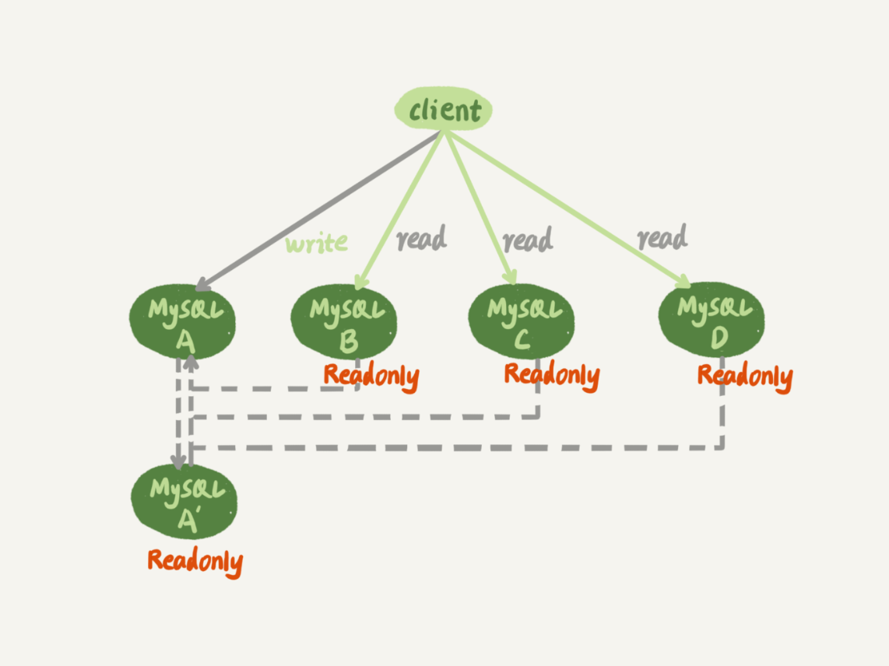

# 27、主库出问题了，从库怎么办?

如图 1 所示，就是一个基本的一主多从结构：



<center>图 1 一主多从基本结构</center>

图中，虚线箭头表示的是主备关系，也就是 A 和 A’互为主备， 从库 B、C、D 指向的是主库 A。一主多从的设置，一般用于读写分离，主库负责所有的写入和一部分读，其他的读请求则由从库分担。

这里需要了解，什么是主库、备库、从库。

假设主库 A 发生了故障，一主多从结构在切换完成后，A‘ 会成为新的主库，从库 B、C、D 也要改接到 A’。正是由于多了从库 B、C、D 重新指向的这个过程，所以主备切换的复杂性也相应增加了。

### 基于点位的主备切换

```mysql
CHANGE MASTER TO 
MASTER_HOST=$host_name 
MASTER_PORT=$port 
MASTER_USER=$user_name 
MASTER_PASSWORD=$password 
MASTER_LOG_FILE=$master_log_name 
MASTER_LOG_POS=$master_log_pos  
```

最后两个参数 MASTER_LOG_FILE 和 MASTER_LOG_POS 表示，要从主库的 master_log_name 文件的 master_log_pos 这个位置的日志继续同步。而这个位置就是我们所说的同步位点，也就是主库对应的文件名和日志偏移量。

**同步位点的方法：**

1.  等待新主库 A’把中转日志（relay log）全部同步完成；(保证 A 和 A’ 数据一致)
2.  在 A’上执行 show master status 命令，得到当前 A’上最新的 File 和 Position；
3.  取原主库 A 故障的时刻 T； 
4.  用 mysqlbinlog 工具解析 A’的 File，得到 T 时刻的位点。 

为什么这个值不精确呢?

因为有可能 A’ 备库和 B 从库 都已经收到了 A 的 binlog，如果用的是 得到 T 时刻的位点，就会重复执行，有可能造成错误。

所以，**通常情况下，我们在切换任务的时候，要先主动跳过这些错误，有两种常用的方法**。

- 一种做法是，主动跳过一个事务：

```
set global sql_slave_skip_counter=1;
start slave;
```

- 另外一种方式是，通过设置 slave_skip_errors 参数，直接设置跳过指定的错误。

我们可以把 slave_skip_errors 设置为 “1032,1062”，这样中间碰到这两个错误时就直接跳过。其中  1062 错误是插入数据时唯一键冲突；1032 错误是删除数据时找不到行 。

### GTID

通过 sql_slave_skip_counter 跳过事务和通过 slave_skip_errors 忽略错误的方法，虽然都最终可以建立从库 B 和新主库 A’的主备关系，但这两种操作都很复杂，而且容易出错。所以，**MySQL 5.6 版本引入了 GTID，彻底解决了这个困难。**

什么是**GTID？**

GTID 的全称是 Global Transaction Identifier，也就是全局事务 ID，<u>是一个事务在提交的时候生成的</u>，是这个事务的唯一标识。它由两部分组成，格式是：

```mysql
GTID=source_id:transaction_id
```

- source_id：是一个实例第一次启动时自动生成的，是一个全局唯一的值；
-  transaction_id ： 是一个整数，初始值是 1，每次提交事务的时候分配给这个事务，并加 1 （这里的事务id 和 之前我们理解的事务id不同，是事务提交后的一个累加器）

**如何启动 GUID 模式**

在启动一个 MySQL 实例的时候，加上参数 gtid_mode=on 和 enforce_gtid_consistency=on 就可以了。

**GUID 的原理是什么？**

他的核心原理非常简单，每一个 MySQL 实例都维护了一个 GTID 集合（set 集合），用来对应“这个实例执行过的所有事务”。这样就保证了不会重复执行了。

**基于 GTID 的主备切换**

 在 GTID 模式下，备库 B 要设置为新主库 A’的从库的语法如下： 

```mysql
CHANGE MASTER TO 
MASTER_HOST=$host_name 
MASTER_PORT=$port 
MASTER_USER=$user_name 
MASTER_PASSWORD=$password 
master_auto_position=1 
```

 其中，master_auto_position=1 就表示这个主备关系使用的是 GTID 协议 

