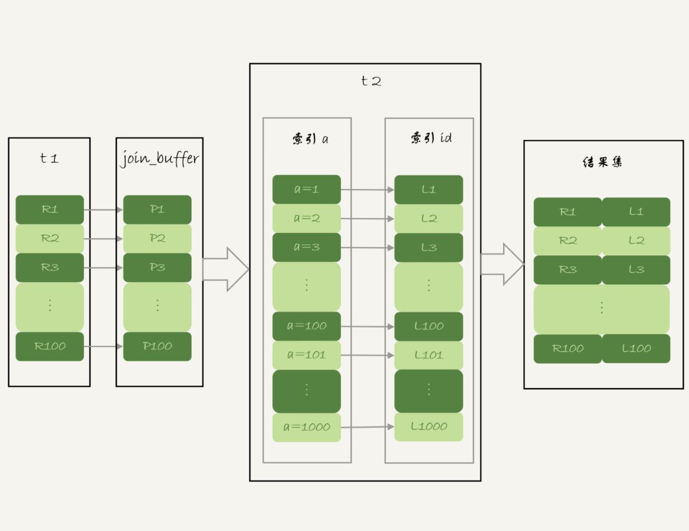

# 35 | join语句怎么优化？

###  Multi-Range Read 优化  (MRR)

```mysql
select * from t1 where a>=1 and a<=100;
```


<center>图 1 基本回表流程</center>

**Multi-Range Read** 简称 MMR， 这个优化的主要目的是尽量使用顺序读盘。 

如果表中的列不是的增长方向不是和id的增长方向一致。那么就会出现随机访问，性能是相对较差。虽然“按行查”这个机制不能改，但是调整查询的顺序，还是能够加速的。

**因为大多数的数据都是按照主键递增顺序插入得到的，所以我们可以认为，如果按照主键的递增顺序查询的话，对磁盘的读比较接近顺序读，能够提升读性能。**

 这，就是 MRR 优化的设计思路。此时，语句的执行流程变成了这样： 

1.  根据索引 a，定位到满足条件的记录，将 id 值放入 read_rnd_buffer 中 ; 
2.  将 read_rnd_buffer 中的 id 进行递增排序； 
3.  排序后的 id 数组，依次到主键 id 索引中查记录，并作为结果返回。 

这里，read_rnd_buffer 的大小是由 read_rnd_buffer_size 参数控制的。如果步骤 1 中，read_rnd_buffer 放满了，就会先执行完步骤 2 和 3，然后清空 read_rnd_buffer。之后继续找索引 a 的下个记录，并继续循环。

> 如果你想要稳定地使用 MRR 优化的话，需要设置set optimizer_switch="mrr_cost_based=off"。（官方文档的说法，是现在的优化器策略，判断消耗的时候，会更倾向于不使用 MRR，把 mrr_cost_based 设置为 off，就是固定使用 MRR 了。）

**MRR 能够提升性能的核心**在于，这条查询语句在索引 a 上做的是一个范围查询（也就是说，这是一个多值查询），可以得到足够多的主键 id。这样通过排序以后，再去主键索引查数据，才能体现出“顺序性”的优势。 

###  Batched Key Access  (BKA)

理解了 MRR 性能提升的原理，我们就能理解 MySQL 在 5.6 版本后开始引入的 Batched Key Access(BKA) 算法了。这个 BKA 算法，其实就是对 NLJ 算法的优化。

NLJ 算法执行逻辑是：从驱动表，一行行地取出值，再到驱动表去做 join。 也就是说，对于被驱动表 来说，每次都是匹配一个值。这时，MRR 的优势就用不上了 。

怎么才能一次性多传一些值给被驱动表呢？方法就是从驱动表中多拿一些出来。

我们知道 join_buffer 在 BNL 算法里的作用，是暂存驱动表的数据。但是在 NLJ 算法里并没有用。那么，我们刚好就可以复用 join_buffer 到 BKA 算法中。



<center>图 2 Batched Key Access 流程</center>

图中，我在 join_buffer 中放入的数据是 P1~P100，表示的是只会取查询需要的字段。当然，如果 join buffer 放不下 P1~P100 的所有数据，就会把这 100 行数据分成多段执行上图的流程。其实 BKA 算法就是利用 MRR 算法地核心思想，多拿一些出来进行顺序读，即使批量地读取，又能顺序读，性能自然提升了。

**如何开启 BKA**

如果要使用 BKA 优化算法的话，你需要在执行 SQL 语句之前，先设置 

```mysql
set optimizer_switch='mrr=on,mrr_cost_based=off,batched_key_access=on';
```

其中，前两个参数的作用是要启用 MRR。这么做的原因是，BKA 算法的优化要依赖于 MRR。

### BNL 算法的性能问题

使用 Block Nested-Loop Join(BNL) 算法时，可能会对被驱动表做多次扫描。如果这个被驱动表是一个大的冷数据表，除了会导致 IO 压力大以外，还会对系统有什么影响呢？

由于 InnoDB 对 Bufffer Pool 的 LRU 算法做了优化，即：第一次从磁盘读入内存的数据页，会先放在 old 区域。如果 1 秒之后这个数据页不再被访问了，就不会被移动到 LRU 链表头部，这样对 Buffer Pool 的命中率影响就不大。

**对Buffer Pool 的影响**

- 如果一个使用 BNL 算法的 join 语句，多次扫描一个冷表，而且这个语句执行时间超过 1 秒，就会在再次扫描冷表的时候，把冷表的数据页移到 LRU 链表头部。 这种情况对应的，是冷表的数据量小于整个 Buffer Pool 的 3/8，能够完全放入 old 区域的情况。
- 如果这个冷表很大，就会出现另外一种情况：业务正常访问的数据页，没有机会进入 young 区域。由于优化机制的存在，一个正常访问的数据页，要进入 young 区域，需要隔 1 秒后再次被访问到。但是，由于我们的 join 语句在循环读磁盘和淘汰内存页，进入 old 区域的数据页，很可能在 1 秒之内就被淘汰了。这样，就会导致这个 MySQL 实例的 Buffer Pool 在这段时间内，young 区域的数据页没有被合理地淘汰。

**大表 join 操作虽然对 IO 有影响，但是在语句执行结束后，对 IO 的影响也就结束了。但是，对 Buffer Pool 的影响就是持续性的，需要依靠后续的查询请求慢慢恢复内存命中率。**

**减少对Buffer Pool 影响的措施**： 你可以考虑增大 join_buffer_size 的值，减少对被驱动表的扫描次数 。

 BNL 算法对系统的影响主要包括三个方面： 

1.  可能会多次扫描被驱动表，占用磁盘 IO 资源； 
2.  判断 join 条件需要执行 M*N 次对比（M、N 分别是两张表的行数），如果是大表就会占用非常多的 CPU 资源； 
3. 可能会导致 Buffer Pool 的热数据被淘汰，影响内存命中率。

如果确认优化器会使用 BNL 算法，就需要做优化。优化的常见做法是，给被驱动表的 join 字段加上索引，把 BNL 算法转成 BKA 算法。

### BNL 转 BKA

- **如果适合在被驱动表上加索引**，直接添加索引即可键 BNL 转为 BKA 算法优化。
- **不适合在被驱动表上加索引**，如被驱动表是大表，而且该查询是低频查询，加索引就浪费，不加就慢，这时需要通过**临时表**。

 使用临时表的大致思路是： 

1.  把被驱动表中满足条件的数据放在临时表 tmp_t 中；
2.  为了让 join 使用 BKA 算法，给临时表 tmp_t 的字段加上索引；
3.  让表驱动表 和 tmp_t 做 join 操作  

### 小结

总体来看，不论是在原表上加索引，还是用有索引的临时表，我们的思路都是让 join 语句能够用上被驱动表上的索引，来触发 BKA 算法，提升查询性能。

**NLJ 和 BNJ 的优化方法**

1. BKA 优化是 MySQL 已经内置支持的，建议你默认使用； 
2. BNL 算法效率低，建议你都尽量转成 BKA 算法。优化的方向就是给被驱动表的关联字段加上索引；
3. 基于临时表的改进方案，对于能够提前过滤出小数据的 join 语句来说，效果还是很好的；
4. MySQL 目前的版本还不支持 hash join，但你可以配合应用端自己模拟出来，理论上效果要好于临时表的方案。（查找出来通过hash 自己匹配）

