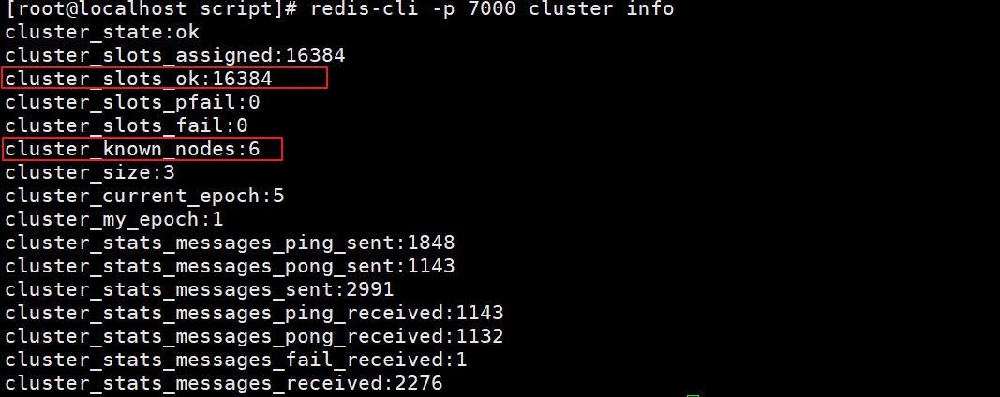
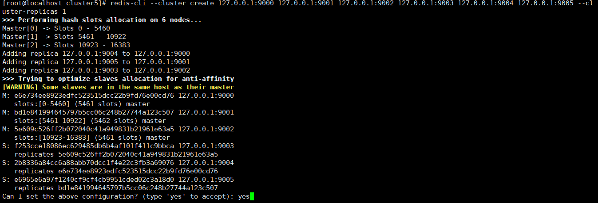

# Redis Cluster 集群搭建

*本教程参考于，《一站式学习Redis，从入门到高可用分布式实践》中的第9章《Redis Cluster》*

**本教程不涉及原理讲解，需要理解原理请参考视频。**

Redis Cluster 搭建的方式有三种

- 原生命令搭建
  - 方便理解集群原理
  - <font color='red'>生产环境不推荐</font>
- 官方工具搭建 redis-trib.rb（redis version <5.0）
  - 高效、准确
  - <font color='red'>推荐在生产环境下使用</font>
- 官方工具 redis-cli (redis>=5.0)
  - 高效、准确
  - <font color='red'>推荐在生产环境下使用</font>
  - [教程]( https://redis.io/topics/cluster-tutorial)

### 运行环境

- centos7 (本次是单机搭建，生产环境需要多台物理机)
- Redis 5.0.8 （安装教程参考于 《Redis Sentinel 搭建》）

### 集群架构

- 原生命令搭建端口号为 7000-7005
- redis-trib.rb 搭建端口号为 8000-8005
- redis-cli 搭建端口号为 9000-9005


## 原生命令搭建

主要步骤：

- 配置集群节点
- meet
- 指派槽
- 主从
- 验证集群

### 配置集群节点

#### 配置节点

- **节点 redis-7000.conf**：

  ```properties
  port 7000
  daemonize yes
  pidfile "/var/run/redis-7000.pid"
  logfile "7000.log"
  dir "/usr/redis/data"
  dbfilename "dump-7000.rdb"
  cluster-enabled yes
  cluster-config-file nodes-7000.conf
  cluster-require-full-coverage no
  protected-mode no
  ```

- **快速生成其他节点 redis-700X.conf** (其中 X=1~5)

  ```shell
  sed 's/7000/7001/g' redis-7000.conf > redis-7001.conf
  sed 's/7000/7002/g' redis-7000.conf > redis-7002.conf
  sed 's/7000/7003/g' redis-7000.conf > redis-7003.conf
  sed 's/7000/7004/g' redis-7000.conf > redis-7004.conf
  sed 's/7000/7005/g' redis-7000.conf > redis-7005.conf
  ```

  

#### 启动节点

- 启动命令

  ```shell
  redis-server redis-7000.conf 
  redis-server redis-7001.conf 
  redis-server redis-7002.conf 
  redis-server redis-7003.conf 
  redis-server redis-7004.conf 
  redis-server redis-7005.conf 
  ```

- 验证

  


### meet

- 操作

   `redis-cli -p 任意节点端口  cluster meet 其他节点ip 其他节点端口`

  ```shell
  redis-cli -p 7000  cluster meet 127.0.0.1 7001
  redis-cli -p 7000  cluster meet 127.0.0.1 7002
  redis-cli -p 7000  cluster meet 127.0.0.1 7003
  redis-cli -p 7000  cluster meet 127.0.0.1 7004
  redis-cli -p 7000  cluster meet 127.0.0.1 7005
  ```

- 验证

  在任意节点执行 `redis-cli -p 节点端口 cluster nodes` 都有 6个节点的信息

  

### 指派槽

- 命令 

  假设给7000节点分配槽 0：`redis-cli -p 7000 cluster addslots 0`

- 脚本 `addslots.sh`

  ```sh
  start=$1
  end=$2
  port=$3
  for slot in `seq ${start} ${end}`
  do
          echo "slot:${slot}"
          redis-cli -p ${port} cluster addslots ${slot}
  done
  ```

- 执行脚本分配槽

  ```shell
  sh addslots.sh 0 5461 7000
  sh addslots.sh 5462 10922 7001
  sh addslots.sh 10923 16383 7002
  ```

- 验证，执行 `redis-cli -p 7000 cluster info`,验证16384个槽分配完成了

  

### 主从

- 查询 node_id, 执行`redis-cli -p 7000 cluster nodes`

  

- 设置主从，命令 `redis-cli -p 从节点端口 cluster replicate 主节点node-id `。

  如 7000节点的从节点为7003 。可以执行`redis-cli -p 7003 cluster replicate d1eddb7765cfdcf70338dbaa6dabdefb849943aa`。

  依次添加从节点（集群架构图一致）

  ```shell
  redis-cli -p 7003 cluster replicate d1eddb7765cfdcf70338dbaa6dabdefb849943aa
  redis-cli -p 7004 cluster replicate dfb500469b47783cc3a84bf5875be045cdb0a281
  redis-cli -p 7005 cluster replicate 35467d3b0443f4438ccfa090500d934bc16f6964
  ```

- 验证，执行`redis-cli -p 7000 cluster nodes`

  

### 验证主从

- 命令 `redis-cli -p 7000 -c`

- 验证

  

至此 ，手动搭建 redis cluster 已经完成了。

## 官方工具搭建(redis-trib.rb)

#### 主要步骤：

- 调整 [redis 4.0. 14](http://download.redis.io/releases/redis-4.0.14.tar.gz)

- ruby环境准备
- 配置Redis节点并启动
- 一键启动集群

#### ruby环境准备

- 源码编译
  - [下载]( http://www.ruby-lang.org/zh_cn/ ) `wget https://cache.ruby-lang.org/pub/ruby/2.7/ruby-2.7.0.tar.gz`
  - 解压 `tar -xvf ruby-2.7.0.tar.gz`
  - 进入ruby-2.7.0目录 `cd ruby-2.7.0`
  - 执行 `./configure -prefix=/usr/local/ruby ` <font color='red'>注意:这里可能会出错，参考本文最后“可能出现的问题”</font>
  - 安装`make && make install`
  
- [rvm]( https://rvm.io/ )
  - [参考教程]( https://www.runoob.com/ruby/ruby-installation-unix.html )
  -   Install GPG keys  ,`gpg2 --recv-keys 409B6B1796C275462A1703113804BB82D39DC0E3 7D2BAF1CF37B13E2069D6956105BD0E739499BDB`
  -  Install RVM ,`\curl -sSL https://get.rvm.io | bash -s stable`
  - 选择版本，`rvm list known`
  - 安装ruby，`rvm install 2.7.0`
  
- 验证 `ruby -v` <font color='red'>注意:这里可能会出错，参考本文最后“可能出现的问题”</font>

- [下载](  https://rubygems.org/gems/redis/versions/  ) ruby的reids客户端 `wget https://rubygems.org/downloads/redis-4.1.3.gem`

- 安装`gem install -l redis-4.1.3.gem`

- 执行 `gem list -- check redis gem`

- 验证，进入`cd /usr/redis/src` 执行`./redis-trib.rb`

  

- 安装 redis-trib.rb。`cp /usr/redis/src/redis-trib.rb /usr/local/bin/`

#### 配置节点

- redis-8000.conf

  ```properties
  port 8000
  daemonize yes
  pidfile "/var/run/redis-8000.pid"
  logfile "8000.log"
  dir "/usr/redis/data"
  dbfilename "dump-8000.rdb"
  cluster-enabled yes
  cluster-config-file nodes-8000.conf
  cluster-require-full-coverage no
  protected-mode no
  ```

- 快速生成其他节点 redis-800X.conf (其中 X=1~5)

  ```shell
  sed 's/8000/8001/g' redis-8000.conf > redis-8001.conf
  sed 's/8000/8002/g' redis-8000.conf > redis-8002.conf
  sed 's/8000/8003/g' redis-8000.conf > redis-8003.conf
  sed 's/8000/8004/g' redis-8000.conf > redis-8004.conf
  sed 's/8000/8005/g' redis-8000.conf > redis-8005.conf
  ```

- 启动节点

  ```shell
  redis-server redis-8000.conf
  redis-server redis-8001.conf
  redis-server redis-8002.conf
  redis-server redis-8003.conf
  redis-server redis-8004.conf
  redis-server redis-8005.conf
  ```

- 验证

  

  

#### 一键启动集群

- 命令：

  ```shell
  redis-trib.rb  create --replicas 1 127.0.0.1:8000 127.0.0.1:8001 127.0.0.1:8002 127.0.0.1:8003 127.0.0.1:8004 127.0.0.1:8005
  ```

- 验证：

  

  `redis-cli -p 8000 cluster info`

  

  `redis-cli -p 8000 cluster nodes`

  

  `set hello world`

  

### 官方工具 redis-cli (redis 5+)

#### 主要步骤

- 切换环境为 redis5+
- 配置节点并启动
- 一键启动集群

#### 配置节点并启动

- redis-9000.conf

  ```properties
  port 9000
  daemonize yes
  pidfile "/var/run/redis-9000.pid"
  logfile "9000.log"
  dir "/usr/redis/data"
  dbfilename "dump-9000.rdb"
  cluster-enabled yes
  cluster-config-file nodes-9000.conf
  cluster-require-full-coverage no
  protected-mode no
  ```

- 快速生成其他节点 redis-900X.conf (其中 X=1~5)

  ```shell
  sed 's/9000/9001/g' redis-9000.conf > redis-9001.conf
  sed 's/9000/9002/g' redis-9000.conf > redis-9002.conf
  sed 's/9000/9003/g' redis-9000.conf > redis-9003.conf
  sed 's/9000/9004/g' redis-9000.conf > redis-9004.conf
  sed 's/9000/9005/g' redis-9000.conf > redis-9005.conf
  ```

- 启动节点

  ```shell
  redis-server redis-9000.conf
  redis-server redis-9001.conf
  redis-server redis-9002.conf
  redis-server redis-9003.conf
  redis-server redis-9004.conf
  redis-server redis-9005.conf
  ```
  
- 验证
  
  

#### 一键启动集群

- 命令：

  ```shell
  redis-cli --cluster create 127.0.0.1:9000 127.0.0.1:9001 \
  127.0.0.1:9002 127.0.0.1:9003 127.0.0.1:9004 127.0.0.1:9005 \
  --cluster-replicas 1
  ```

- 验证

  

  `redis-cli -p 9000 cluster info`

  

  `redis-cli -p 9000 cluster nodes`

  


## 可能出现的问题

1. 编译的 Ruby 2.3.0 缺少 openssl 支持的解决方法：

   解决：

   1. 通过`find / -name openssl `找出 openssl。
   2. 在 `./configure -prefix=/usr/local/ruby ` 该成 `./configure -prefix=/usr/local/ruby --with-openssl-dir=/usr/include/openssl`

2.  -bash: /usr/bin/ruby: No such file or directory 

   解决：

   1.  `/usr/local/bin/ruby --version` 能正确的输出版本信息
   2. 执行`ln -s /usr/local/bin/ruby /usr/bin/ruby` 

3. 没有安装gcc

   现象：

   ```shell
   checking for ruby... false
   checking build system type... x86_64-pc-linux-gnu
   checking host system type... x86_64-pc-linux-gnu
   checking target system type... x86_64-pc-linux-gnu
   checking for gcc... no
   checking for cc... no
   checking for cl.exe... no
   ```

   解决： `yum install -y gcc`